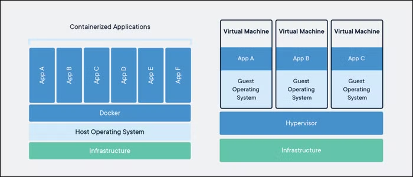
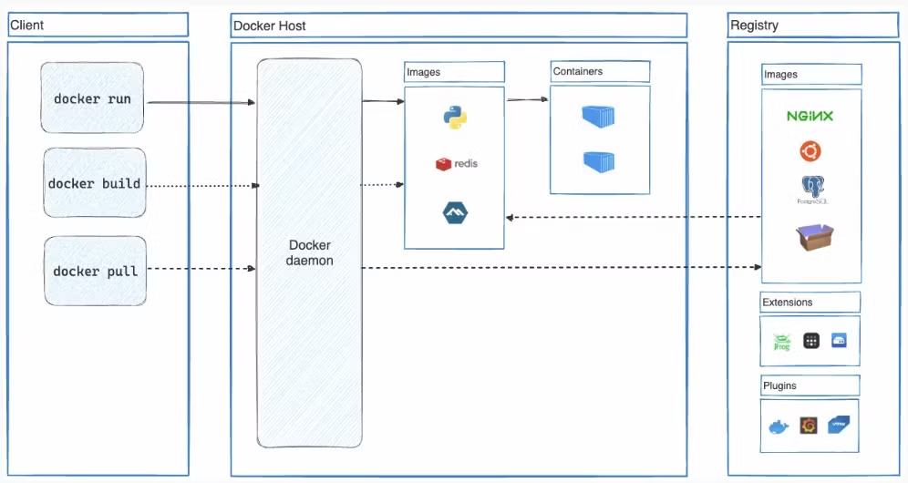
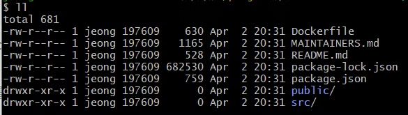
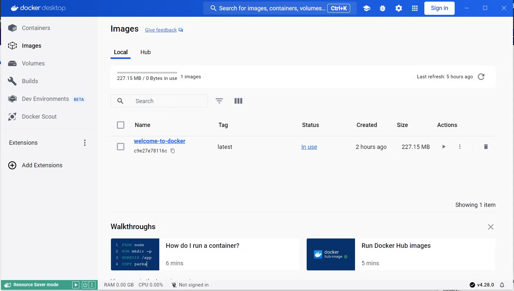
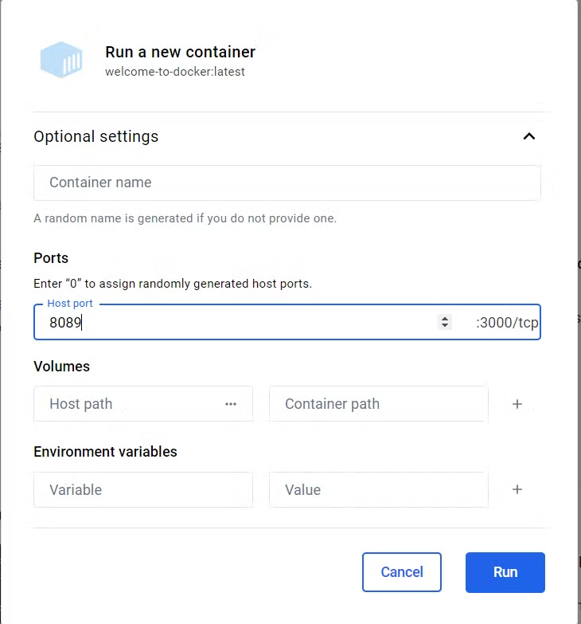
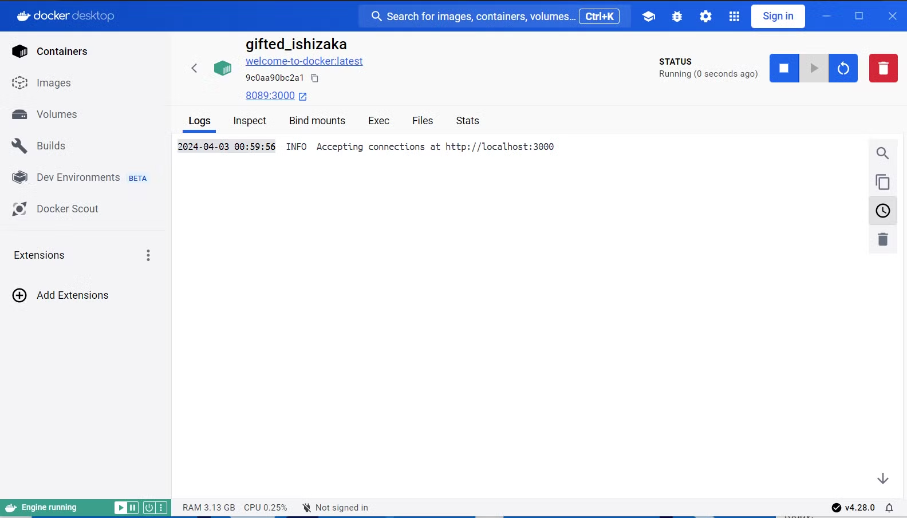
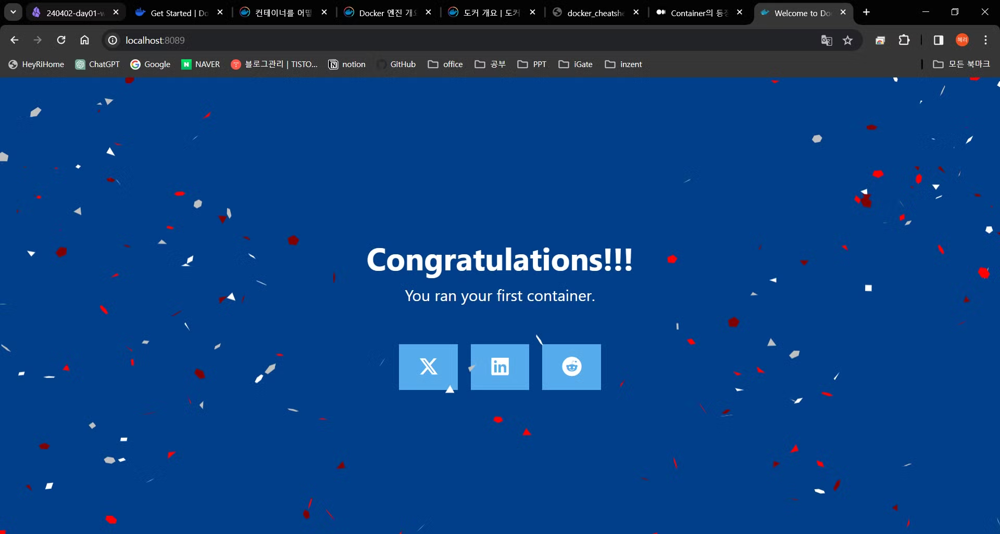
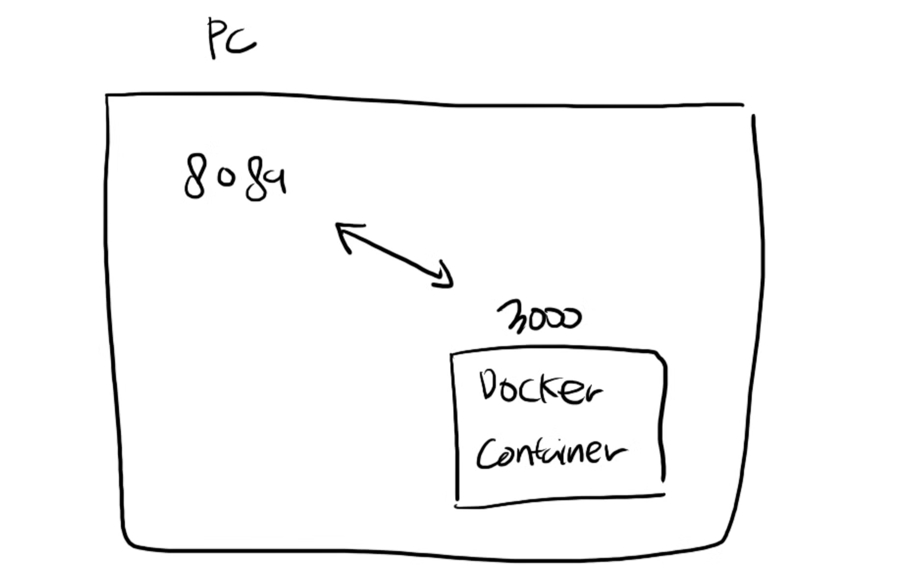

# [Docker] Container와 Docker - 기본

Docker 와 Container 의 개념과 구조 간단한 사용 방법을 알아보자

## Container
### ✅ **컨테이너가 생겨난 이유**

1. 컴퓨터 자원을 최대한 사용해서 여러 어플리케이션을 사용하는 것이 필요해짐
2. 여러 사용자가 컴퓨팅 자원을 공유하게 되면서 프로세스 간 영향을 주고 받게 되고, 심지어 한 사용자가 시스템을 중단 시켜버리는 경우까지 발생 (ex. 하나의 프로그램이 리소스를 전부 사용해서 다른 프로그램까지 중단되는 경우 등)
3. ‘가상화(virtualization)’ 를 사용해 하나의 컴퓨터에 여러 애플리케이션을 독립적으로 구동하는 방법이 필요
4. 하이퍼바이저 가상화를 통한 방법
‘VM(Virtual Machine)’ 와 같은 하이퍼바이저 가상화를 통해 하나의 OS에 여러 개의 독립적인 가상 운영체제를 실행. 각 가상 머신은 독립적인 컴퓨팅 환경의 자원(CPU, 메모리…)을 사용해 프로그램 간 영향도를 줄여서 실행할 수 있음



1. 이러한 VM 서버를 구축하기 위해선 많은 비용 + 자원을 많이 소모하게 되는 단점이 있음
2. 컨테이너 가상화 방법
애플리케이션 실행 환경을 OS와 분리해 하나의 OS에서 여러 어플리케이션을 독립적인 공간에서 실행할 수 있도록 해 안정성을 높이고 자원을 효율적으로 사용한다.

<br />

### ✅ 컨테이너 핵심 기능

> [!NOTE]
> 컨테이너는 리눅스 커널의 두 가지 핵심 기능인 **Cgroups**(Control Groups)와 **네임스페이스**(Namespace)를 활용하여 이루어진다

- **Cgroups (Control Groups)**
    
    : 프로세스 그룹의 리소스 사용량을 모니터링하고 제한하는 기능
    
    ⇒ 컨테이너가 할당된 자원을 초과하여 사용하는 것을 방지 (시스템 안정성, 컨테이너의 시스템  영향도 최소화)
    
- **네임스페이스 (Namespace)**
    
    : 프로세스에 제한된 시스템 뷰 제공. 프로세스가 자신의 네임스페이스 내에서만 시스템 리소스를 볼 수 있도록 함
    
    ⇒ 각 컨테이너마다 파일 시스템 마운트, 네트워크, 사용자ID 등을 독립적으로 할당하여 관리 (호스트 시스템 또는 다른 컨테이너의 리소스와의 충돌 방지)
    

<br /><br />

## Docker

### ✅ 도커 구성



도커는 client-server 구조를 가지며 각 요소의 설명은 아래와 같다.

- **Docker daemon (dockerd)**
    - 컨테이너 관리를 위한 백그라운드 프로세스
    - 이미지 생성, 컨테이너 실행, 네트워크 설정 등의 작업 수행
    - 서비스 관리를 위해 다른 데몬과 통신할 수 있음
- **Docker Client (CLI, API)**
    - 사용자가 CLI 명령 또는 API를 사용해 통해 docker deamon을 제어하거나 상호작용 함
- **Docker Registry**
    - Docker 이미지 저장
    - Docker Hub은 공개 저장소로 기본적으로 Docker Hub에서 이미지를 찾음
    - 개인 레지스트리를 구성할 수도 있음

<br />

### ✅ 도커 사용하기


> [TIP]
> [도커 실습 가이드](https://docs.docker.com/guides/walkthroughs/run-a-container/)

<br />


#### 1. 도커 데스크탑을 다운로드 받는다

[Get Started | Docker](https://www.docker.com/get-started/)

<br />

#### 2. 실습 가이드에 따라 Github에서 샘플 어플리케이션을 복제한다

```powershell
$ git clone https://github.com/docker/welcome-to-docker
```

<br />

#### 3. 해당 위치에 welcome-to-docker ****폴더가 생성되었고, 내부로 들어가면 아래와 같이 구성되어 있다.



<br />

#### 4. DockerFile 의 내용을 확인하면 아래와 같다. 노드 기반으로 동작하는 것을 확인 할 수 있다.

```powershell
$ cat DockerFile
# Start your image with a node base image
FROM node:18-alpine

# The /app directory should act as the main application directory
WORKDIR /app

# Copy the app package and package-lock.json file
COPY package*.json ./

# Copy local directories to the current local directory of our docker image (/app)
COPY ./src ./src
COPY ./public ./public

# Install node packages, install serve, build the app, and remove dependencies at the end
RUN npm install \
    && npm install -g serve \
    && npm run build \
    && rm -fr node_modules

EXPOSE 3000

# Start the app using serve command
CMD [ "serve", "-s", "build" ]

```

<br />

#### 5. 컨테이너를 실행하기 위해 이미지가 필요하므로 이미지를 빌드한다

```powershell
$ cd welcome-to-docker
$ docker build -t welcome-to-docker .
```

<br />

#### 6. 도커 데스크탑에 들어가면 이미지 목록에 welcome-to-docker 이름의 이미지가 추가되었고, ▶버튼을 클릭해 실행시킨다.



<br />

#### 7. 아래와 같이 호스팅할 포트를 지정하고 [Run] 을 선택한다.



<br />

#### 8. 그럼 아래와 같이 컨테이너 탭으로 넘어오게 되고, 성공처럼 보이는 로그가 남았다



<br />

#### 9. 로그의 [localhost:3000](http://localhost:3000) 이 아닌 호스팅한 8089번 포트로 접속 테스트하면 아래와 같은 페이지가 나온다.



<br />

> [!NOTE]
> **8089:3000 포트 의미**
>
>3000번은 어플리케이션이 지정한 포트로, 컨테이너 내부에서 사용되는 포트이다. 각 컨테이너는 독립적이므로 다른 컨테이너와 동일한 포트를 사용해도 된다.
>
>8089번은 호스트 OS에서 접근하는 포트로 해당 pc에서 8089번으로 접근하면 도커 내부적으로 3000번으로 연결된다. (VM의 포트 포워딩을 생각하면 이해하기 쉽다)
> 
> 
> 


<br />

## 마치며

이렇게 Docker와 Container의 기본 개념 및 구조, Docker의 기본 사용 방법을 알아보았다.

Docker Hub에 등록된 서비스들은 `docker pull` 또는 `docker run` 통해 간단하게 내려받아 테스트해볼 수 있었다.

기존에 어플리케이션을 빌드&배포한 것에 비하면 엄청나게 간단하게 배포해볼 수 있다고 느껴졌다. 

그래서 이번에 회사 어플리케이션의 로컬 환경을 다시 구축하게 되어 DB 구성은 도커를 활용해보았는데, Docker Hub에서 Oracle을 다운로드 받고 사용자 구성 및 연결을 하는데 10분도 채 걸리지 않았다.

사이드 프로젝트와 같은 간단한 프로그램 개발 시에도 충분히 활용할 수 있을 것으로 보인다.

<br />

---

<br />

[원티드 BackEnd 챌린지] 강의를 듣고 작성한 글 입니다. 

**출처**

- 강사님 자료: https://lec.syoh.dev/01.Project/wanted/240402-day01-wanted
- docker docs: https://docs.docker.com/