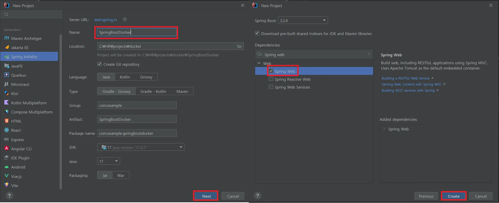
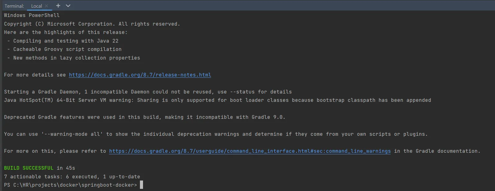
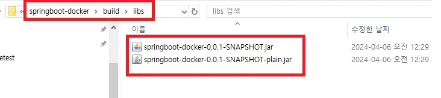
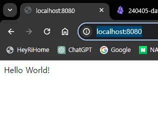
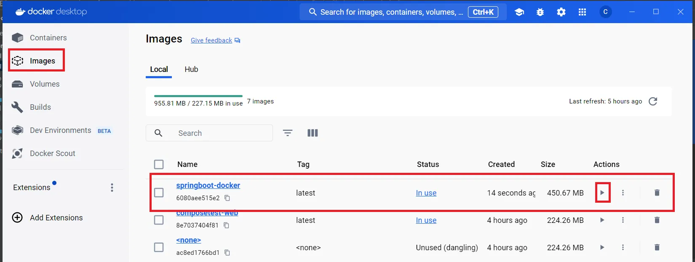
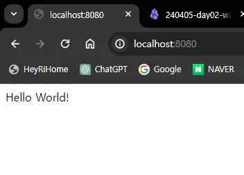
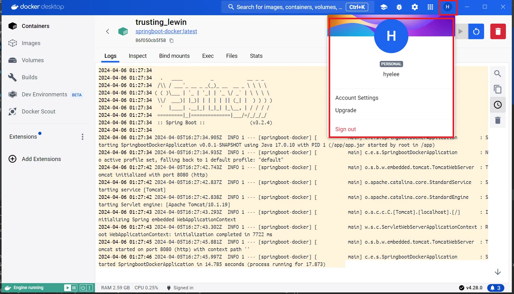
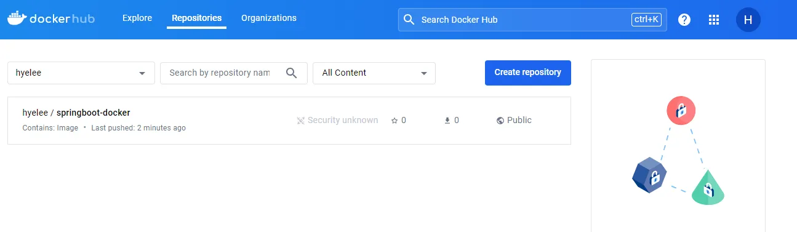
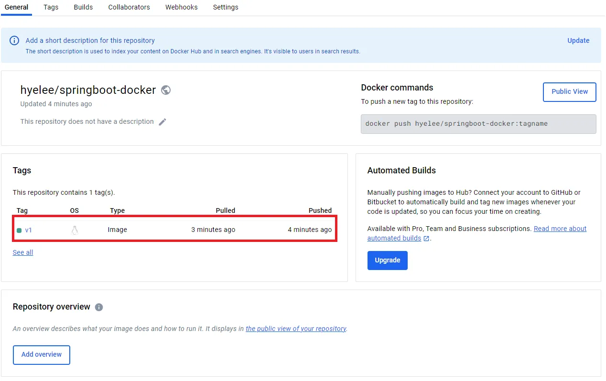

# SpringBoot(Gradle) 프로젝트 Docker 배포, Docker Hub 등록

> [!NOTE]
>
> 💡 **Spring Boot 프로젝트 Docker로 배포하기**
>
> 참고: [https://www.docker.com/blog/kickstart-your-spring-boot-application-development](https://www.docker.com/blog/kickstart-your-spring-boot-application-development/)

<br />

## 1️⃣ 간단한 Spring Boot Application 생성

- IntelliJ에서 File > New > Project.. 선택 후 Spring Web 의존성만 추가하여 프로젝트를 생성한다.



- SpringbootDockerApplication.java 파일을 아래와 같이 수정한다.

```java
@RestController
@SpringBootApplication
public class SpringbootDockerApplication {

    public static void main(String[] args) {
        SpringApplication.run(SpringbootDockerApplication.class, args);
    }

    @RequestMapping("/")
    public String home(){
        return "Hello World!";
    }

}
```

<br />

## 2️⃣ Gradle Build

- IntelliJ 하단의 Terminal 을 통해 Windows PowerShell을 열고 명령어 입력한다

```bash
./gradlew build
```

- Build Successful 로그를 확인하고 프로젝트 폴더/build/libs 내부에 jar가 생성되었는지 확인한다





- build한 jar를 기동한다

```bash
java -jar build/libs/springboot-docker-0.0.1-SNAPSHOT.jar
```

```bash
  .   ____          _            __ _ _
 /\\ / ___'_ __ _ _(_)_ __  __ _ \ \ \ \
( ( )\___ | '_ | '_| | '_ \/ _` | \ \ \ \
 \\/  ___)| |_)| | | | | || (_| |  ) ) ) )
  '  |____| .__|_| |_|_| |_\__, | / / / /
 =========|_|==============|___/=/_/_/_/
 :: Spring Boot ::                (v3.2.4)

2024-04-06T00:37:12.051+09:00  INFO 6616 --- [springboot-docker] [           main] c.e.s.SpringbootDockerApplication        : Starting SpringbootDockerApplication v0.0.1-SNAPSHOT using
 Java 17.0.10 with PID 6616 (C:\HR\projects\docker\springboot-docker\build\libs\springboot-docker-0.0.1-SNAPSHOT.jar started by jeong in C:\HR\projects\docker\springboot-docker)       
2024-04-06T00:37:12.066+09:00  INFO 6616 --- [springboot-docker] [           main] c.e.s.SpringbootDockerApplication        : No active profile set, falling back to 1 default profile: 
"default"
2024-04-06T00:37:15.149+09:00  INFO 6616 --- [springboot-docker] [           main] o.s.b.w.embedded.tomcat.TomcatWebServer  : Tomcat initialized with port 8080 (http)
2024-04-06T00:37:15.200+09:00  INFO 6616 --- [springboot-docker] [           main] o.apache.catalina.core.StandardService   : Starting service [Tomcat]
2024-04-06T00:37:15.201+09:00  INFO 6616 --- [springboot-docker] [           main] o.apache.catalina.core.StandardEngine    : Starting Servlet engine: [Apache Tomcat/10.1.19]
2024-04-06T00:37:15.337+09:00  INFO 6616 --- [springboot-docker] [           main] o.a.c.c.C.[Tomcat].[localhost].[/]       : Initializing Spring embedded WebApplicationContext
2024-04-06T00:37:15.341+09:00  INFO 6616 --- [springboot-docker] [           main] w.s.c.ServletWebServerApplicationContext : Root WebApplicationContext: initialization completed in 30
26 ms
2024-04-06T00:37:16.188+09:00  INFO 6616 --- [springboot-docker] [           main] o.s.b.w.embedded.tomcat.TomcatWebServer  : Tomcat started on port 8080 (http) with context path ''
2024-04-06T00:37:16.255+09:00  INFO 6616 --- [springboot-docker] [           main] c.e.s.SpringbootDockerApplication        : Started SpringbootDockerApplication in 5.327 seconds (proc
ess running for 6.161)

```

- [localhost:8080](http://localhost:8080) 에 접속해 “Hello World!”가 정상적으로 출력되는지 확인한다



<br />

## 3️⃣ Dockerfile 만들기

- 프로젝트 최상단에 Dockerfile을 생성한다

```docker
FROM eclipse-temurin:17-jdk-focal

WORKDIR /app

COPY . ./
CMD ["./gradlew", "clean", "bootJar"]

COPY ./build/libs/*.jar ./app.jar

ENTRYPOINT ["java", "-jar", "./app.jar"]
```

- Dockerfile이 수행하는 내용은 아래와 같다
    - `FROM eclipse-temurin:17-jdk-focal`
        
        : 기본 이미지로 jdk17을 사용한다. 사용한 이미지는 경량화된 jdk로 보면 된다
        
    - `WORKDIR /app`
        
        : Application 코드를 보관할 작업 폴더를 만든다
        
    - `COPY . ./`
        
        : 소스 코드와 gradle 파일들을 컨테이너로 복사한다
        
    - `CMD ["./gradlew", "clean", "bootJar"]`
        
        : gradle build를 수행해 jar를 만든다
        
    - `COPY ./build/libs/*.jar ./app.jar`
        
        : 생성한 jar를 app.jar 로 복사한다
        
    - `ENTRYPOINT ["java", "-jar", "./app.jar"]`
        
        : `ENTRYPOINT`는 컨테이너를 시작 시 실행할 명령어로, 컨테이너 시작 시 app.jar를 실행시킨다.
        
    
- 다시 터미널로 돌아와서 도커 이미지를 빌드한다

```bash
docker build -t springboot-docker .

# docker build : docker image build 의 약어 (Dockerfile을 이용해 이미지를 빌드한다)
# -t : --tag의 약어 ("이름:태그" 형식으로 이름과 태그를 지정하고 태그는 생략 가능하다. 여기에선 springboot-docker 라는 이름으로 이미지를 빌드했다)
```

- Docker Desktop 이나 터미널에서 이미지를 실행한다



- 컨테이너 로그에 아래와 같이 잘 기동되는지 확인한다

```bash
2024-04-06 01:27:34 
2024-04-06 01:27:34   .   ____          _            __ _ _
2024-04-06 01:27:34  /\\ / ___'_ __ _ _(_)_ __  __ _ \ \ \ \
2024-04-06 01:27:34 ( ( )\___ | '_ | '_| | '_ \/ _` | \ \ \ \
2024-04-06 01:27:34  \\/  ___)| |_)| | | | | || (_| |  ) ) ) )
2024-04-06 01:27:34   '  |____| .__|_| |_|_| |_\__, | / / / /
2024-04-06 01:27:34  =========|_|==============|___/=/_/_/_/
2024-04-06 01:27:34  :: Spring Boot ::                (v3.2.4)
2024-04-06 01:27:34 
2024-04-06 01:27:34 2024-04-05T16:27:34.905Z  INFO 1 --- [springboot-docker] [           main] c.e.s.SpringbootDockerApplication        : Starting SpringbootDockerApplication v0.0.1-SNAPSHOT using Java 17.0.10 with PID 1 (/app/app.jar started by root in /app)
2024-04-06 01:27:34 2024-04-05T16:27:34.935Z  INFO 1 --- [springboot-docker] [           main] c.e.s.SpringbootDockerApplication        : No active profile set, falling back to 1 default profile: "default"
2024-04-06 01:27:42 2024-04-05T16:27:42.743Z  INFO 1 --- [springboot-docker] [           main] o.s.b.w.embedded.tomcat.TomcatWebServer  : Tomcat initialized with port 8080 (http)
2024-04-06 01:27:42 2024-04-05T16:27:42.837Z  INFO 1 --- [springboot-docker] [           main] o.apache.catalina.core.StandardService   : Starting service [Tomcat]
2024-04-06 01:27:42 2024-04-05T16:27:42.838Z  INFO 1 --- [springboot-docker] [           main] o.apache.catalina.core.StandardEngine    : Starting Servlet engine: [Apache Tomcat/10.1.19]
2024-04-06 01:27:43 2024-04-05T16:27:43.293Z  INFO 1 --- [springboot-docker] [           main] o.a.c.c.C.[Tomcat].[localhost].[/]       : Initializing Spring embedded WebApplicationContext
2024-04-06 01:27:43 2024-04-05T16:27:43.302Z  INFO 1 --- [springboot-docker] [           main] w.s.c.ServletWebServerApplicationContext : Root WebApplicationContext: initialization completed in 7722 ms
2024-04-06 01:27:45 2024-04-05T16:27:45.881Z  INFO 1 --- [springboot-docker] [           main] o.s.b.w.embedded.tomcat.TomcatWebServer  : Tomcat started on port 8080 (http) with context path ''
2024-04-06 01:27:46 2024-04-05T16:27:45.997Z  INFO 1 --- [springboot-docker] [           main] c.e.s.SpringbootDockerApplication        : Started SpringbootDockerApplication in 14.785 seconds (process running for 17.873)
```

- localhost:8080에 접속해서 Hello World! 동일하게 출력되면 이미지는 성공적으로 만들어졌다



<br />

## 4️⃣ Docker Hub에 이미지 올리기

이제 Docker Hub에 나의 이미지를 공유해보자

- Docker Hub 가입하고 오기

[Docker Hub Container Image Library | App Containerization](https://hub.docker.com/)

- Docker Desktop 에서 로그인



- 터미널에서 한 번 더 로그인한다

```bash
docker login

Authenticating with existing credentials...
Login Succeeded
```

- 이미지에 태그를 추가한다

```bash
docker tag springboot-docker:latest hyelee/springboot-docker:v1
```

- Docker Hub에 생성한 태그 버전을 올린다

```bash
docker push hyelee/springboot-docker:v1

The push refers to repository [docker.io/hyelee/springboot-docker]
763e16bc7e15: Preparing
9d02c9272b27: Preparing
8fd13e9f7207: Preparing
9acce15d8ea4: Preparing
aab1524fb316: Preparing
b3f19996423b: Preparing
8f2a3fa3d629: Preparing
5faf9c0a9efe: Preparing
b3f19996423b: Waiting
8f2a3fa3d629: Waiting
5faf9c0a9efe: Waiting
9acce15d8ea4: Mounted from library/eclipse-temurin
aab1524fb316: Mounted from library/eclipse-temurin
8fd13e9f7207: Pushed
b3f19996423b: Mounted from library/eclipse-temurin
8f2a3fa3d629: Mounted from library/eclipse-temurin
5faf9c0a9efe: Mounted from library/eclipse-temurin
763e16bc7e15: Pushed
9d02c9272b27: Pushed
v1: digest: sha256:8a6cf0f2648ed5c8107252e2a67bc623531887f79e9110aa5eb90938b8229ee3 size: 1998
```

- Docker Hub 에 들어가면 방금 올린 Repository가 업로드되어 있는 것을 확인할 수 있다



