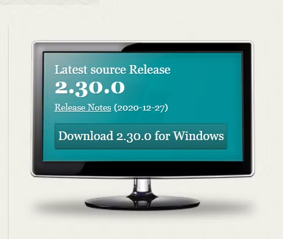
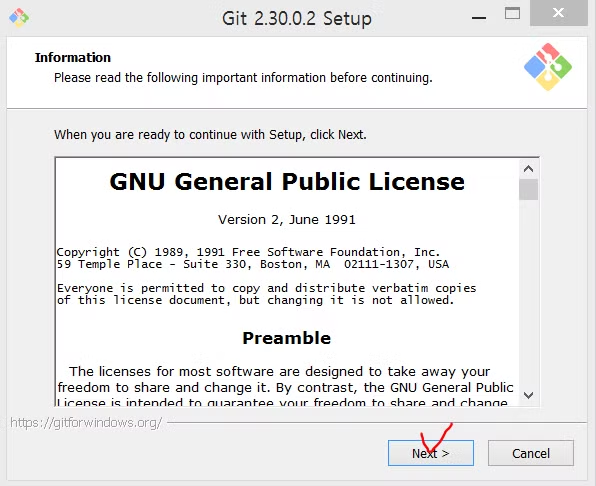
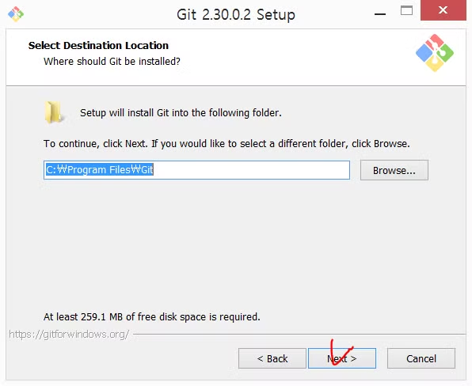
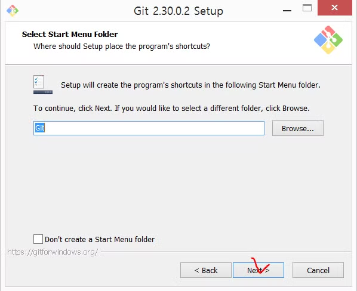
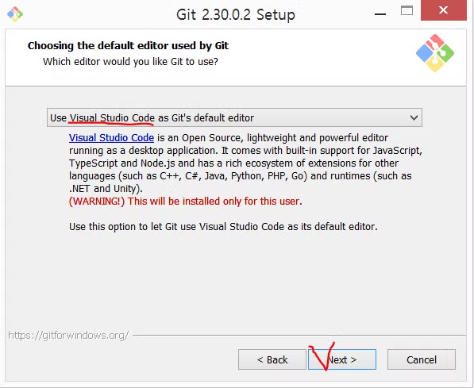
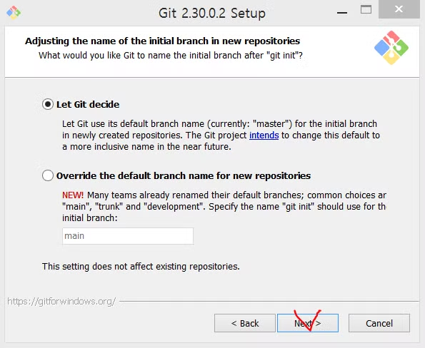
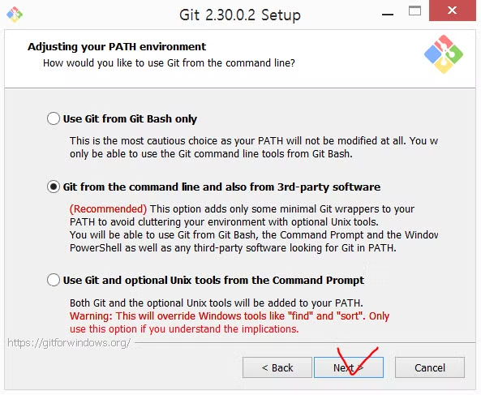
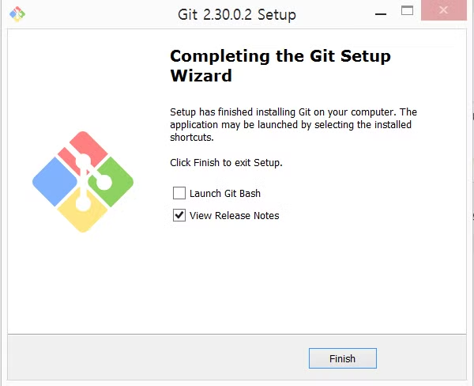
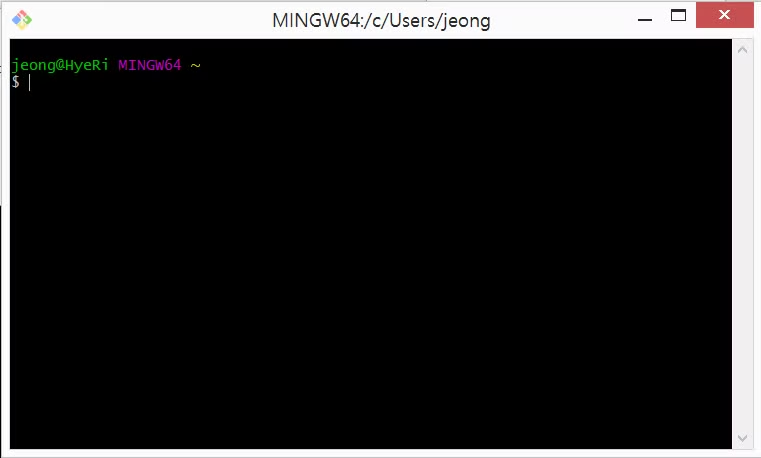

# Git 설치

## Git 개요
**깃(git)** 은 버전 관리 시스템(VCS: Version Control System)이다

깃은 파일의 변경사항을 자동으로 저장하고, 원하는 버전의 파일로 돌아갈 수 있다

- **깃이 제공하는 기능**
    1. 소스 코드 백업
    2. 코드를 이전 상태로 쉽게 돌아감 
    3. 여러 사람과 소스 코드를 통합 관리할 수 있음

 

## 깃 다운로드

- 깃 사이트 접속

    [Git 홈페이지 이동](https://git-scm.com/)

 

- 자신의 OS에 맞춰 다운로드를 받을 수 있게 나온다

    

 

- 다운로드가 끝나면 설치 시작

    next 클릭

    

 

- Git 설치 경로이다. 변경하지 않고 넘어간다

    next 클릭

    

 

- 설치할 컴포넌트들, 기본값을 변경하지 않고 그냥 넘어간다

    next 클릭

    

 

- 시작메뉴에 git 폴더를 만든다. 만들고 싶지 않으면 아래의 체크박스를 클릭하고 넘어간다

    next 클릭

    

 

- 기본 에디터 선택, VSCode를 사용중이라 변경했다

     본인이 사용하는 에디터로 변경하고 next
     
     

 

- 그 뒤에 나오는 창들은 기본값 그대로 next를 계속 눌러준다

    

    

 

-- 생략 --

 

- 모두 기본값으로 넘어가면 다운로드를 시작한다

    

 

- 설치가 끝나면 finish를 눌러 창을 닫는다

    

 

## ■ **깃 설치 확인**

Git을 설치하면 Git Bash도 같이 설치된다.
 

> [!NOTE]
> **Git Bash** \
> : 윈도우의 컴퓨터에서 유닉스/리눅스의 명령어들을 사용해 제어할 수 있도록 도와주는 프로그램

 

- Git Bash를 실행시킨다.

    

 

- Git Bash에 `git` 또는 `git —version` 명령 입력 시 정상 동작한다면 깃이 잘 설치된 것이다.

    