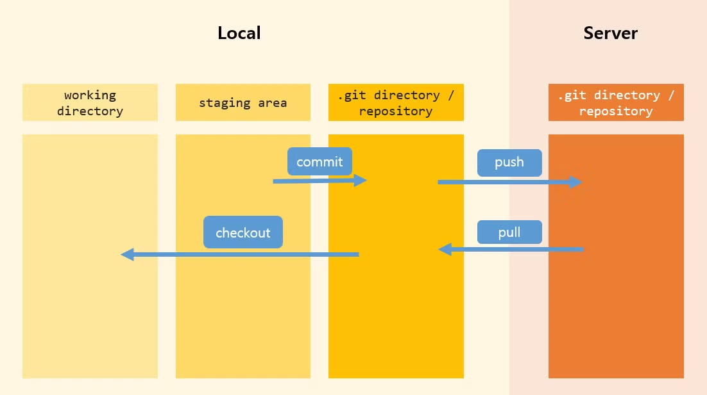
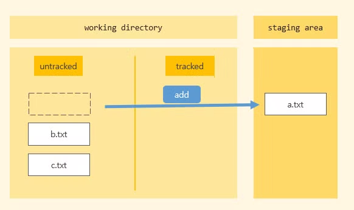
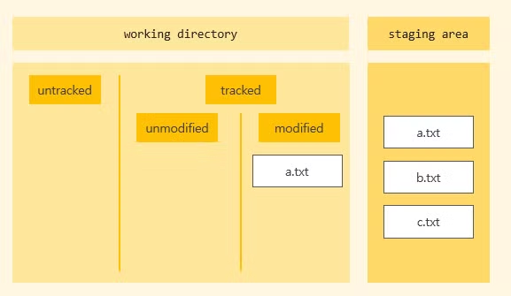
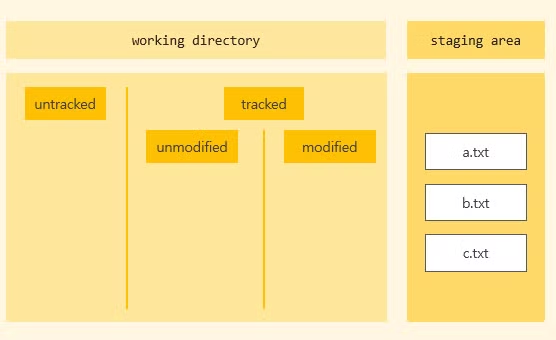
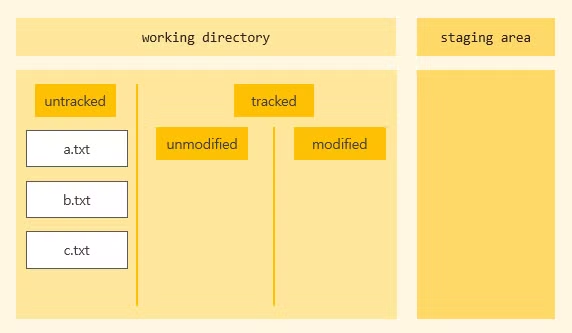

# Git 구조

## 1. Git 구조

Git 은 크게보면 4가지 공간으로 나누어져 있다. 

- **Git 전체 구조**

> **[ Local ]**
> 
> **working directory** \
> : 프로젝트의 파일을 수정하며 작업을 진행하는 공간
> 
> **staging area** \
> : 히스토리에 저장할 준비를 마친 파일을 옮겨 두는 공간\
> 
> **.git directory / repository** \
> : 버전의 히스토리를 가지고있는 공간
> 

 

> **[ Server ]**
>
> **.git directory /repository**\
> : commit된 파일을 git hub와 같은 공용 서버에 올려두는 공간
>
> ※ 커밋 시 함께 저장되는 정보
> - 버전
> - 메세지
> - 작성자
> - 날짜/시간
> 

 

- **Working Directory 구조**
    
    working directory를 자세히 보면 아래와 같이 구성되어 있다.
    

 

## 2. 상태에 따른 작업 공간 변화

각 명령어 사용 시 작업 공간에서 어떻게 처리되는지 알아보자.

1. a.txt, b.txt, c.txt 파일 생성 후 **`git add a.txt`**

${\textsf{\color{gray}a.txt 파일이 staging area로 이동}}$

 

2. **`git add .`** 후 a.txt 파일 수정
    

${\textsf{\color{gray}b, c 파일이 staging에 추가되었고 working directory에 a.txt 파일이 modified 되어있음}}$

 

3.  **`add a.txt`**  
    

${\textsf{\color{gray}staging 의 a.txt와 합쳐진다}}$

 

1. `git rm --cached *` 
    

${\textsf{\color{gray}모든 파일이 다시 untracked 로 돌아온다}}$

${\textsf{\color{gray}add된 상태에서}}$ `git status` ${\textsf{\color{gray}를 확인해보면 해당 명령으로 돌아올 수 있다고 알려준다}}$
