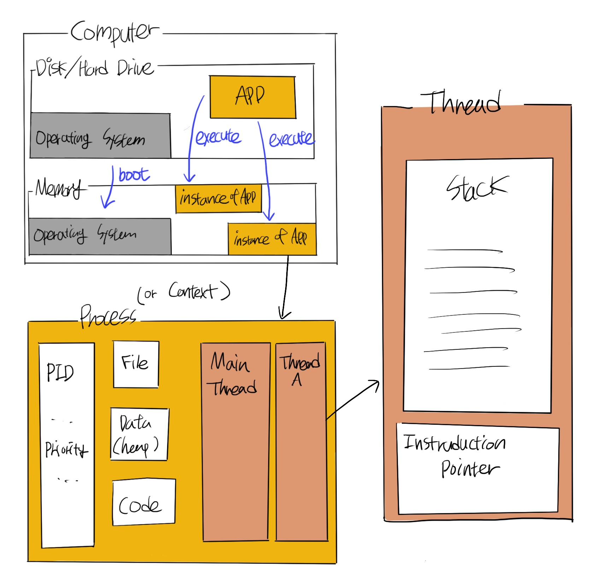

# 프로세스(Process), 스레드(Thread), 컨텍스트 스위치(Context Switch)

 

## ✅ **시스템 기본 동작 방식 - Process, Thread**

> ### 💡 Process & Thread
> - **Process** \
> 실행 중인 하나의 프로그램 인스턴스, 하나 이상의 스레드를 가지며 독립적으로 실행
>
> - **Thread** \
>프로세스의 작업을 실제 실행하는 주체, 각 스레드는 프로세스 내의 다양한 리소스 공유

 

각종 운영체제와 어플리케이션은 파일의 형태로 저장되어 있다.

컴퓨터 실행 시 운영체제(Operating System)가 디스크에서 메모리로 로드되고

운영체제는 사용자와 하드웨어, CPU 사이의 상호작용을 도와주는 역할을 수행한다.

우리가 어플리케이션을 실행하면 운영체제가 디스크의 프로그램을 메모리로 가져와 인스턴스를 생성하여 실행하는데, 이렇게 **메모리에서 실행 중인 하나의 인스턴스**를 **프로세스(Process)** 또는 **컨텍스트(Context)** 라고 한다.

프로세스는 PID, File, Data, Heap, Code, Thread 로 구성되어 있으며, 하나의 프로세스에는 최소 하나 이상의 스레드(Main Thread)를 가지고 작업을 실행한다. 각 프로세스는 시스템에서 독립적으로 실행된다.

**스레드(Thread)**는 **프로세스 내에서 실제 작업을 수행하는 주체**로,  스택(Stack), 명령어 포인터(Instrudction Pointer)로 구성되며 프로세스 내의 컴포넌트(File, Heap 등..)을 공유한다. Stack은 메모리 영역으로 지역변수와 기능이 실행되는 영역, Instruction Pointer는 스레드가 실행할 다음 명령어의 주소를 가르키는 영역이다.

 

## ✅ **컨텍스트 스위치(Context Switch)**

> ### 💡 Context Switch
> 하나의 cpu에서 여러 스레드를 돌아가며 실행 및 종료하는 것

일반적으로 코어 수 < 프로세스 수 < 스레드 수로 구성되기 때문에 스레드는 CPU의 실행을 두고 서로 경쟁하는 구조를 가진다.

하나의 코어에서는 스레드를 하나만 실행하기 때문에 **운영체제가 코어에 여러 스레드를 하나씩 번갈아 가며 할당하여 실행과 종료를 반복**하는데, 이것을  **컨텍스트 스위치(Context Switch)**라고 한다.

> **중요한 점**
cpu에서 실행되는 각 스레드는 cpu 내의 레지스터, 캐시 및 메모리 내의 커널 리소스와 같은 자원의 일부분 사용하기 때문에, 다른 스레드로 전환 시 기존의 데이터 저장 및 사용중이던 리소스의 복원 작업을 실행한다.
그래서 동시에 많은 스레드를 다룰 경우 *Thrashing이 발생해 효율성이 떨어진다. (병행성의 대가)
스레드는 프로세스보다는 리소스를 적게 사용하는데, 프로세스 내의 자원을 공유하기 때문이다. 그래서 같은 프로세스 내부의 스레드의 컨텍스트 스위치가 다른 프로세스 간의 스레드 컨텍스트 스위치보다 더 효율적이다.

**Thrashing (스래싱)**
운영체제가 필요한 작업을 생산적으로 실행하는 대신 스레드 관리에 더 많은 시간을 소모하는 것
> 

## ✅ **멀티 스레드 vs 멀티 프로세스**

**멀티 스레드 특징**

- 여러 스레드는 많은 자원을 공유
- 스레드의 생성과 파기가 빠르다
- 같은 프로세스 안에서 스레드를 전환하는 것이 다른 프로세스에서 전환하는 것 보다 더 빠르다
- 하나의 스레드로 인한 프로세스 전체 다운 가능성이 있다

**멀티 프로세스 특징**

- 프로그램을 독립된 프로세스에서 실행가능
- 보안 혹은 안정성이 중요한 경우 사용하는게 좋다
- 서로 관련 없는 작업으로 공유 자원이 필요 없는 경우 멀티 스레드를 구성할 필요가 없다

 

## ✅ 스레드 중지

### 1. 중지 작업이 필요한 이유

1. 스레드는 작업 중이 아닐 때도 리소스를 사용함 (메모리, 일부 커널 리소스)
2. 실행 중에는 CPU와 캐시 메모리도 사용
→ 따라서 스레드의 작업이 끝났는데 어플리케이션이 작동 중이라면 스레드의 리소스를 정리해줘야 함
3. 스레드의 오작동 시 반드시 스레드 중지
4. 어플리케이션 전체를 중단하기 위해 (프로세스에 하나의 스레드라도 작업 중이라면 Main 스레드가 끝났더라도, 어플리케이션이 종료되지 않음)

### 2. 중지 방법

