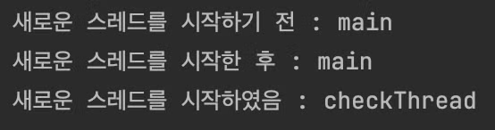
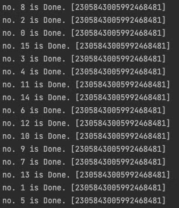

# [Java] 스레드 (Thread) 기본 사용법

## 1. 스레드 생성

`Thread`는 빈 객체이기 때문에 매개변수 없이 `new`연산으로는 새로운 생성할 수 없다.

따라서 `Runnable` 인터페이스를 상속한 객체를 인수로 전달해주며 생성해야 한다.

```java
/**
 * 새로운 스레드 객체 생성
 */
Thread thread = new Thread(new Runnable() {
    @Override
    public void run() {
        // 여기서 해당 thread.start() 시 작업할 코드를 작성한다
    }
});

/**
 * 위의 코드를 람다로 줄이면 아래와 같이 구현이 가능하다   * jdk8 이상
 */
 Thread secondThread = new Thread(()->{
 	// 여기서 해당 thread.start() 시 작업할 코드를 작성한다
 });
```

## 2. 스레드 실행


위에서 만든 스레드를 실제로 실행하기 위해서는 start() 메서드를 메인 메서드에서 호출해주어야 한다.

그러면 JVM이 새 스레드를 생성해 운영체제에 전달한다.

```java
thread.start();
secondThread.start();
```

<br />

또, 스레드는 운영체제에 의해 스케줄링 되어 비동기적으로 실행된다.

```java
Thread checkThread = new Thread(new Runnable() {
    @Override
    public void run() {
    	System.out.println("새로운 스레드를 시작하였음 : " + Thread.currentThread().getName());
    }
});
checkThread.setName("checkThread");

System.out.println("새로운 스레드를 시작하기 전 : " + Thread.currentThread().getName());
checkThread.start();
System.out.println("새로운 스레드를 시작한 후 : "  + Thread.currentThread().getName());
```

그래서 위 코드의 결과는 아래와 같이 나타난다.



> 💡 **checkThread 가 main 스레드보다 더 늦게 찍히는 이유\
> :** checkThread의 스케줄링에 시간이 걸리기 때문\
> 먼저 main 스레드의 프린트문이 찍히고 난 후 스케줄링이 끝난 checkThread가 비동기적으로 실행되었기 때문임을 알 수 있다.
> 

<br />


## 3. Thread 클래스 기능들

Thread 클래스는 유용한 기능들을 제공한다.

```java
// 현재 스레드의 스레드 객체 정보 가져오기
Thread currentThread = Thread.currentThread();

// 스레드 객체 안에는 Id, Name 등 다양한 정보를 확인할 수 있다
System.out.println("현재 실행 중인 스레드 정보 : " + currentThread.getName());

// 현재 스레드를 원하는 밀리초만큼 멈추기
Thread.sleep(1000);

// Thread 이름 변경, 스레드 수가 많은 프로그램을 만들 경우, 스레드 이름은 디버깅에 꼭 필요하다.
thread.setName("HyeRiThread");

// Thread 에 동적 우선순위 부여하기 (동적 우선순위 : static priority + bonus)
thread.setPriority(Thread.MAX_PRIORITY); // 값은 1-10 까지 값을 줄 수 있음
```
<br />

### **3-1. 유의할 점**

- `thread.sleep(millis)` 은 스레드를 정지하기 위해 반복적으로 실행되는 명령어가 아니다. 단순히 운영체제에게 스레드를 스케줄링 하지 말라는 명령만 전달하기 때문에 현재 스레드가 전달된 시간동안 cpu를 사용하지 않는다.
- `thread.setPriority(priority)`에서 지정한 동적 우선순위는 개발자가 부여할 수 있는 정적 우선순위(static priority)이다. priority를 부여한 스레드가 cpu 코어의 개수 보다 적거나 같을 경우 병렬로 실행될 수 있기 때문에 큰 영향을 미치지 못한다.

<br />

동적 우선순위의 개념은 아래 게시글에서 확인할 수 있다.

[**[Java] 멀티스레딩 - 스레드 스케줄링(Thread Scheduling), 동적 우선순위(Dynamic Priority)**](../Thread%20Scheduling_Dynamic%20Priority/page.md)

<br />

### **3-2. 우선순위 테스트**

> ✔️ 21억번 루프를 실행할 작업 스레드를 생성하고, 해당 스레드를 16번 만들어서 실행시켰다.

- 작업 스레드 클래스 (1부터 21억번 합산 루프 작업 수행)

```java
public class PriorityThread extends Thread {

    public PriorityThread(String name){
        this.setName(name);
    }

    @Override
    public void run() {
        long sum = 0;
        for(int i=1; i<Integer.MAX_VALUE; i++){
            sum += i;
        }
        System.out.println(this.getName() + " is Done. ["+sum+"]");
    }
}
```
<br />

- 테스트 클래스 (작업 스레드 16개의 우선순위를 마지막 스레드에 높게 부여하여 실행)

```arduino
public class PriorityTest {
    public static void main(String[] args){
        int num = 16;
        for(int i=0; i<num; i++){
            Thread thread = new PriorityThread("no. " + i);
            if(i != num-1){
                thread.setPriority(Thread.MIN_PRIORITY);
            }else {
                thread.setPriority(Thread.MAX_PRIORITY);
            }
            thread.start();
        }
    }
}
```
<br />

해당 코드의 결과는 아래와 같았다.




> **실행결과 해석**\
> 15번이 가장 먼저 끝날 줄 알았으나, 그런 결과가 나오지 않아 내 노트북의 코어 수를 확인해보니 8코어였다.\
> 병렬로 실행되어 가장 먼저 끝나지는 않은 것으로 보인다. 그래도 비교적 먼저 작업이 완료되는 것을 확인할 수 있었다.
> 

<br />

## 4. 스레드 예외처리

스레드는 예외 처리를 해주지 않으면 프로세스 전체가 종료될 수 있으므로 필수로 처리해주어야 한다.

<br />

### 4-1. Thread 예외 Handler 설정

: Thread에 동일한 Handler를 설정하여 예외 처리를 전역적으로 관리할 수 있다.

```java
Thread thread = new Thread(()->{
    throw new RuntimeException("RunTimeException!!!!!!!!");
});

// 예외처리 핸들러를 생성해 모든 스레드의 오류를 전역적으로 관리하기
Thread.UncaughtExceptionHandler exceptionHandler = new Thread.UncaughtExceptionHandler() {
    @Override
    public void uncaughtException(Thread t, Throwable e) {
        System.out.println("Thread Exception Handler->check Exception[" + t.getName() + " : " + e.getMessage()+"]");
    }
};
thread.setUncaughtExceptionHandler(exceptionHandler);
```
<br />

실행 시 스레드에서 RuntimeException이 발생했을 때 Handler가 처리하는 것을 알 수 있다.


<br />

---
**참조**
- https://www.udemy.com/course/java-multi-threading/