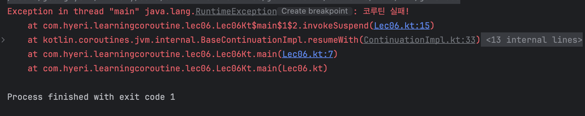

# Structured Concurrency

## 코루틴 예외 전파
자식 코루틴에서 예외가 발생하면 부모 코루틴으로 전파된다.
이때 부모 코루틴이 본인을 취소시키기 위해 다른 자식 코루틴에도 취소요청을 보낸다.

### 예시 코드
```kotlin

fun main(): Unit = runBlocking {
    launch {
        delay(1_000L)
        println("A")
    }

    launch {
        delay(500L)
        throw RuntimeException("코루틴 실패!")
    }
}
```


### 출력 결과
첫번째 자식 코루틴의 "A" 출력은 실행되지 않고 부모코루틴과 함께 취소되었음을 알 수 있다.


## Structured Concurrency
이렇게 자식 코루틴과 부모 코루틴이 한 몸처럼 움직이는 것을 Structured Concurrency 라고 한다 !

Structured Concurrency는 수많은 코루틴이 유실되거나 누수되지 않도록 보장한다.

<br />
다만, CancellationException은 정상적인 취소로 간주하지 않기 때문에
부모 코루틴에게 전파되지 않고, 부모 코루틴의 다른 자식 코루틴이 취소되지도 않는다.

