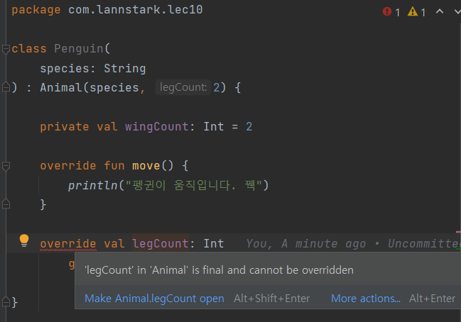
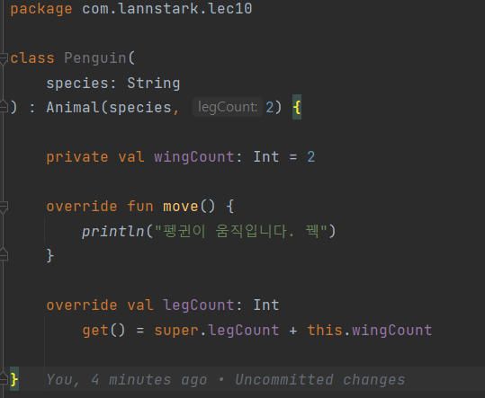

# 코틀린에서 상속을 다루는 방법

> [!NOTE]
> **소스코드**: 
> [lec10: 코틀린에서 상속을 다루는 방법](https://github.com/cos850/java-to-kotlin-starter-guide/tree/master/src/main/kotlin/com/lannstark/lec10)


<br />

## 추상 클래스
java와 동일하게 `abstract` 키워드를 통해 추상 클래스와 메서드를 구현하면 된다.

```kotlin
abstract class Animal (
    protected val species: String,
    protected val legCount: Int
) {
    abstract fun move()
}
```

<br />

### 추상 클래스 상속하기
- 상속 키워드: `:`를 사용한다. (`extends` 아님)
- 부모 클래스의 생성자를 바로 호출한다.([아래 상속 예시 참조](#상속-예시))
- 함수를 재정의할 떄, `@Override` 대신 `override` 키워드를 사용하며, 반드시 붙여야 한다.

> [!TIP]
> - 타입으로 사용하는 경우에는 `:`를 붙여서 사용
>   - ex) `val name: String`
> - 상속으로 사용하는 경우에는 `:` 를 띄워서 사용
>   - ex) `class Cat : Animal`

**예시**
```kotlin
class Cat(species: String) : Animal(species, 4) {
    override fun move() {
        println("꽁꽁 얼어붙은 한강 위로 고양이가 걸어다닙니다.")
    }
}
```
<br />
 
### 부모 클래스 필드의 getter/setter 재정의
부모 클래스의 `val`로 선언된 필드에 커스텀 getter를 만들려면 `open` 키워드를 꼭 붙여줘야 한다.

**예시**
- open을 붙이지 않은 경우

    

- `open` 붙이기
    ```kotlin
    abstract class Animal (
        protected val species: String,
        protected open val legCount: Int    // 커스텀 getter 정의 가능
    ) {
        abstract fun move()
    }
    ```
    
    자식 클래스에 getter를 재정의해도 오류나지 않음!


<br />

## 인터페이스
인터페이스에 default method를 만들 때 `default` 키워드를 붙이지 않아도 된다.

```kotlin
interface Swimable {
    fun act() {
        println("어푸어푸")
    }
}
```

<br />

또한, 인터페이스에서 backing field가 없는 프로퍼티를 선언할 수 있다. 

```kotlin
interface Swimable {

    val swimAbility: Int // custom getter 구현해야 함

    val swimSpped: Int  // swimSpped의 default는 3임
        get() = 3

    /* ... */
}
```


<br />

### 인터페이스 상속
인터페이스 상속은 클래스 상속과 동일하게 `:` 키워드를 사용한다.

```kotlin
class Penguin(
    species: String
) : Animal(species, 2), Swimable, Flyable { /* .. */ }
```

중복되는 인터페이스를 특정할 경우 `super<타입>.act()` 사용한다.

```kotlin
class Penguin(
    species: String
) : Animal(species, 2), Swimable, Flyable {
    /* ... */
    override fun act() {
        super<Swimable>.act()   // java의 `Swimable.super.act();` 와 동일
        super<Flyable>.act()
    }
}
```


<br />

## 클래스를 상속할 때 유의할 점

### 일반 클래스 상속
일반 클래스를 상속하려면, 상속할 클래스에 `open` 키워드를 반드시 붙여야 한다.

### 예시

```kotlin
fun main() {
    Derived(300)
}

open class Base(
    open val number: Int = 100
) {
    init {
        println("base class: number=${number}")
    }
}

class Derived(
    override val number: Int
): Base(number) {
    init {
        println("derived class: number=${number}")
    }
}
```

<br />

### 유의할 점

위 코드를 실행하면 아래와 같은 결과가 나타난다.

```
base class: number=0
derived class: number=300
```

<br />

- **Base 클래스의 init 블록에서 number가 0이 찍히는 이유**

    : Base init 블록에서 접근한 number는 Derived 클래스의 number이므로 아직 하위 클래스인 Derived의 number는 초기화 되지 않은 상태라 결과 값이 0이 나오게 된다.

> [!WARNING]
> 따라서, 상위 클래스를 설계할 때 생성자나 초기화 블록에 사용하는 프로퍼티를 `open` 하지 않도록 유의해야 안다!

<br />

------
### 참조
- [자바 개발자를 위한 코틀린 입문(Java to Kotlin Starter Guide)](https://www.inflearn.com/course/java-to-kotlin/dashboard)