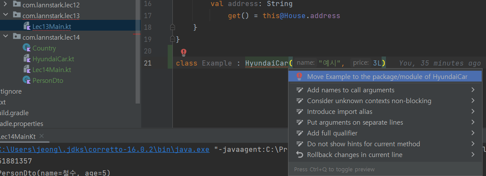

# 코틀린에서 다양한 클래스를 다루는 방법

> [!NOTE]
> **소스코드**: 
> [lec14: 코틀린에서 다양한 클래스를 다루는 방법](https://github.com/cos850/java-to-kotlin-starter-guide/tree/master/src/main/kotlin/com/lannstark/lec14)

> [!TIP]
> 

<br />


## Data Class
DTO (Data Transfer Object) 와 같은 클래스에는 다음과 같은 요소가 기본적으로 들어간다.

- 필드
- 생성자, getter
- equals, hashCode
- toString

코틀린에는 이를 간편하게 만들어주는 Data Class가 존재한다.

```kotlin
data class PersonDto(
    val name: String, 
    val age: Int
)
```

이렇게 data 를 앞에 붙여주면 equals, hashCode, toString 함수를 자동으로 만들어 준다. 

<br />

## enum class
kotlin에서도 enum class를 지원한다.

```kotlin
enum class Country(private val code: String) {
    KOREA("KO"),
    AMERICA("US") ;
}
```
<br />

Java에서 enum이 switch와 활용하면 좋은 것처럼, Kotlin에서도 when과 함께 사용하면 좋다.

- enum 의 변화를 IDE가 감지해서 오류를 낸다.
- else 처리를 하지 않아도 된다.
- 가독성이 좋다.

```kotlin
when(country) {
     Country.KOREA -> TODO()
     Country.AMERICA -> TODO()   
}
```

<br />

## Sealed Class, Sealed Interface
상속이 가능하도록 추상 클래스를 만들고 싶지만, 외부에서는 이 클래스를 상속하지 않고 싶을 때 사용한다.

**컴파일 타임 때 하위 클래스를 모두 기억해서 런타임에 타입이 추가될 수 없다.**

```kotlin
sealed class HyundaiCar(
    val name: String,
    val price: Long
)

class Avante : HyundaiCar("아반떼", 1L)

class Sonata : HyundaiCar("소나타", 2L)

class Grandeur : HyundaiCar("그렌저", 3L)
```

<br />

하위 클래스는 같은 패키지에 있어야 한다.



<br />

enum과 동일한 이유로 when과 함께 사용하면 좋다.

```kotlin
fun handleHyundaiCar(hyundaiCar: HyundaiCar) {
    when(hyundaiCar) {
        is Avante -> TODO()
        is Grandeur -> TODO()
        is Grandeur -> TODO()
    }
}
```

<br />

> [!TTP]
> 추상화가 필요한 Entity, DTO 에 sealed class를 활용

<br />

> [!TTP]
> JDK 17에서도 Sealed Class가 추가되었다!

**예시**
```java
public sealed class Figure 
    permits Circle, Square, Rectangle { // 동일 파일에 하위 클래스를 정의하는 경우 생략 가능
}

final class Circle extends Figure {
    float radius;
}
non-sealed class Square extends Figure {
    float side;
}
sealed class Rectangle extends Figure {
    float length, width;
}
final class FilledRectangle extends Rectangle {
    int red, green, blue;
}
```


<br />

------
### 참조
- [자바 개발자를 위한 코틀린 입문(Java to Kotlin Starter Guide)](https://www.inflearn.com/course/java-to-kotlin/dashboard)