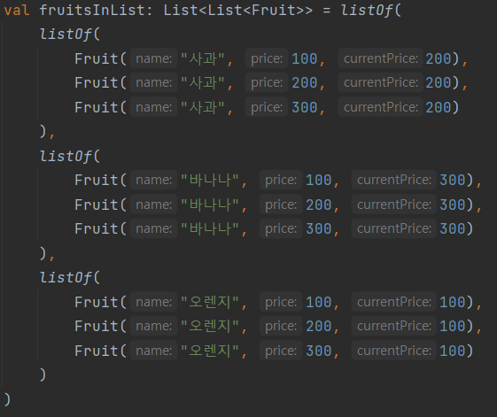

# 코틀린에서 컬렉션을 함수형으로 다루는 방법

> [!NOTE]
> **소스코드**: 
> [lec18: 코틀린에서 컬렉션을 함수형으로 다루는 방법](https://github.com/cos850/java-to-kotlin-starter-guide/tree/master/src/main/kotlin/com/lannstark/lec18)


<br />

 
## filter, map

### filter
filter 사용법
```kotlin
val apples = fruits.filter { fruit -> fruit.name == "사과" }
```

<br />

인덱스와 함께 사용 가능
```kotlin
val bananas = fruits.filterIndexed { idx, fruit ->
    println(idx)
    fruit.name == "바나나"
}
```

### map
map 사용법

```kotlin
val applePrices = fruits
    .filter { fruit -> "사과" == fruit.name }
    .map { fruit -> fruit.price }

// 인덱스와 함께 사용 가능
val bananaPrices = fruits
    .filter { fruit -> "바나나" == fruit.name }
    .mapIndexed { idx, fruit ->
        println(idx)
        fruit.price
    }

// mapping의 결과가 not null인 요소만
val orangePrices = fruits
    .filter { fruit -> "오렌지" == fruit.name }
    .mapNotNull { fruit -> fruit.price }
```

<br />


## 다양한 collection 기능들

### all
모든 요소에 대해 람다 실행 결과가 만족하면 true, 아니면 false

```kotlin
val isAllApple = fruits.all { fruit -> "사과" == fruit.name } // false
```
<br />

### none
all과 반대로 조건을 모두 불만족하면 true 그렇지 않으면 false

```kotlin
val isNoApple = fruits.none { fruit -> "사과" == fruit.name } // false
```
<br />

### any
조건을 하나라도 만족하면 true, 아니면 false

```kotlin
val containsApple = fruits.any { fruit -> "사과" == fruit.name }  // true
```
<br />

### count
개수를 센다.

```kotlin
val fruitsSize = fruits.count() // list의 size와 동일
val numberOfApples = fruits.count {
    fruit -> "사과" == fruit.name
}
```
<br />

### sortedBy, sortedByDescending
- **sortedBy**: 오름차순으로 정렬한다.

```kotlin
val ascendingFruits = fruits.sortedBy { fruit -> fruit.price }

```

- **sortedByDescending**: 내림차순으로 정렬한다.
```kotlin
val descendingFruits = fruits.sortedByDescending { fruit -> fruit.price }
```
<br />

### distinctBy
전달한 람다 결과 값을 기준으로 중복 제거

```kotlin
val distinctFruitsNames = fruits.distinctBy { fruit -> fruit.name }

println("distinctFruitsNames = ${distinctFruitsNames.map { it.name }}") // [사과, 오렌지, 바나나]
```
<br />

### first, firstOrNull
- **first**: 첫번째 값을 가져온다. (무조건 null이 아니어야 함)
- **firstOrNull**: 첫번째 값 또는 null을 가져온다.

```kotlin
println(fruits.first())         // Fruit(name="사과", price=500)
println(fruits.firstOrNull())   // Fruit(name="사과", price=500)

val emptyList = emptyList<Fruit>()
println(emptyList.firstOrNull())    // null
```
<br />

### last, lastOrNull
- **last**: 마지막 값을 가져온다. (무조건 null이 아니어야 함)
- **lastOrNull**: 마지막 값 또는 null 가져온다.

```kotlin
println(fruits.last())         // Fruit(name="바나나", price=1500)
println(fruits.lastOrNull())   // Fruit(name="바나나", price=1500)

val emptyList = emptyList<Fruit>()
println(emptyList.lastOrNull())    // null
```
<br />


## list to map
- **groupBy**: 리스트를 특정 key를 기준으로 그룹핑하기

```kotlin
// 과일 이름을 기준으로 그룹핑
val fruitsMap: Map<String, List<Fruit>> = fruits.groupBy { fruit -> fruit.name } 

// key와 value 한 번에 처리 가능
// 과일 이름을 기준으로 그룹핑한 뒤 가격 목록 가져오기
val fruitPriceMap: Map<String, List<Int>> = fruits.groupBy(
    { fruit -> fruit.name},
    {fruit -> fruit.price}
)
println("fruitPriceMap = ${fruitPriceMap}") 
// fruitPriceMap = {사과=[500, 1000, 1500], 오렌지=[500, 1000, 1500], 바나나=[500, 1000, 1500]}

```
<br />

- **associateBy**: 중복되지 않는 key를 통해 매핑할 때

```kotlin
val fruitsMap2: Map<String, Fruit> = fruits.associateBy { fruit -> fruit.name + fruit.price }

val fruitPriceMap2: Map<String, Int> = fruits.associateBy(
        {fruit -> fruit.name + fruit.price}, {fruit -> fruit.price}
    )
println("fruitPriceMap2 = ${fruitPriceMap2}")
```
<br />


## 중첩된 컬렉션 처리
- **flatten**
    - 감싸진 Collection을 하나의 Collection으로 합쳐줌
- **flatMap**
    - 감싸진 컬렉션을 하나로 합치기 위해 사용
    - 내부의 collection을 인자로 어떤 값을 포함할 것인지 조건을 줄 수 있다.

**데이터 예시**


<br />

**요구사항 예시**

가격이 200인 과일만 하나의 리스트에 담고 싶다면?
```kotlin
val price200: List<Fruit> = fruitsInList.flatMap { 
    list -> list.filter { fruit -> 200 == fruit.price } 
}
println("price200 = ${price200}")
// price200 = [Fruit{name='사과', price=200}, Fruit{name='바나나', price=200}, Fruit{name='오렌지', price=200}]
```
<br />

기본 가격과 현재 가격이 같은 과일만 하나의 리스트로 담고 싶다면?

```kotlin
// 1. Fruit에 price와 currentPrice를 비교하는 로직 추가
data class Fruit(
    val name: String,
    val price: Int,
    val currentPrice: Int = 0
) {
   val isSamePrice: Boolean
       get() = this.price == this.currentPrice
}

// 2. List<Fruit>가 사용할 filter 확장 함수 만들기
fun List<Fruit>.samePriceFilter(): List<Fruit> = this.filter(Fruit::isSamePrice)

// 3. flatMap에서 확장 함수 사용
val samePriceFruits = fruitsInList.flatMap(List<Fruit>::samePriceFilter)

println("samePriceFruits = ${samePriceFruits}")
// samePriceFruits = [Fruit(name=사과, price=200, currentPrice=200), Fruit(name=바나나, price=300, currentPrice=300), Fruit(name=오렌지, price=100, currentPrice=100)]
```


<br />

------
### 참조
- [자바 개발자를 위한 코틀린 입문(Java to Kotlin Starter Guide)](https://www.inflearn.com/course/java-to-kotlin/dashboard)