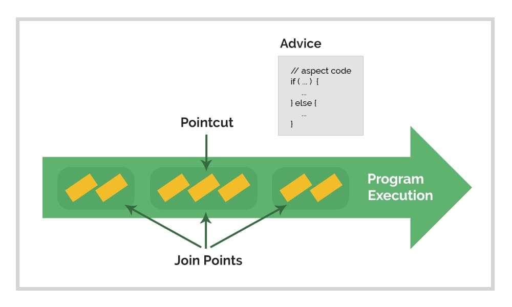
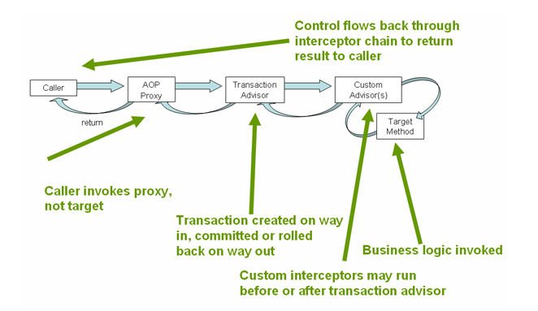
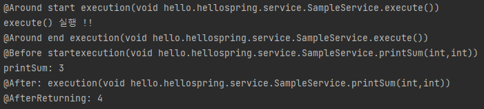

## 1. AOP란?

> 컴퓨팅에서 **관점 지향 프로그래밍**(aspect-oriented programming, AOP)은 횡단 관심사(cross-cutting concern)의 분리를 허용함으로써 모듈성을 증가시키는 것이 목적인 프로그래밍 패러다임이다. 코드 그 자체를 수정하지 않는 대신 기존의 코드에 추가 동작(어드바이스)을 추가함으로써 수행하며, "함수의 이름이 'set'으로 시작하면 모든 함수 호출을 기록한다"와 같이 어느 코드가 포인트컷(pointcut) 사양을 통해 수정되는지를 따로 지정한다. 이를 통해 기능의 코드 핵심부를 어수선하게 채우지 않고도 비즈니스 로직에 핵심적이지 않은 동작들을 프로그램에 추가할 수 있게 한다. 관점 지향 프로그래밍은 관점 지향 소프트웨어 개발의 토대를 형성한다.
>
>- [위키피디아 - 관점 지향 프로그래밍](https://ko.wikipedia.org/wiki/%EA%B4%80%EC%A0%90_%EC%A7%80%ED%96%A5_%ED%94%84%EB%A1%9C%EA%B7%B8%EB%9E%98%EB%B0%8D)
> 

<br />

즉, 어플리케이션의 비즈니스 로직에 **핵심 기능과 공통적인 부가 기능을 분리**하여 모듈성을 증가시키는 프로그래밍 패러다임이다.  

이러한 관점은 **횡단 관심사**(Cross-Cutting Concerns)라 부르는 여러 비즈니스 로직에 걸친 공통적인 로직을 한 곳에서 효과적으로 처리할 수 있다. Spring에서는 트랜잭션 관리에 사용하고 있으며, 사용자가 새로 추가할 수 있도록 지원해준다.

**이를 통해 기존의 코드를 수정하지 않고, 기존 로직에 새로운 기능을 추가할 수 있다.**

<br />

## 2. AOP 용어

Spring AOP에서 사용하는 주요 용어의 의미를 알아보자.



[baeldung.com/spring-aop](https://www.baeldung.com/spring-aop)

- **Aspect**: 관심사(공통된 기능)를 모듈화한 것
- **Advice**: 특정 조인 포인트에서 Aspect가 실행할 행동
- **Join Point**: 프로그램 실행 중 Aspect의 Advice가 적용될 수 있는 지점으로, Spring에서는 메서드 실행을 뜻한다
- **Pointcut**: 조인 포인트(Join Point)를 선택하는 데 사용되는 표현식으로, 어떤 메서드가 Advice의 대상이 되는지 결정할 수 있음

<br />

## 3. AOP 흐름



[spring docs - aop](https://docs.spring.io/spring-framework/reference/data-access/transaction/declarative/tx-decl-explained.html)

위 그림은 스프링이 AOP를 사용해 트랜잭션 관리를 수행하는 로직이다.

메서드를 호출 할 때, 바로 대상 메소드를 실행하는 것이 아니라 AOP Proxy를 통해 Advisor 를 호출한 후 내부에서 실제 대상 메소드를 실행하는 것을 알 수 있다.

<br />

## 3. Aspect 코드 작성 예시

이제 간단한 예제를 통해 Aspect 코드를 작성해보자.

Spring AOP는 XML기반 방식 또는 Aspectj의 어노테이션 스타일을 사용할 수 있는데,

여기서는 AssertJ 어노테이션 방식을 사용한다.
<br />

### **3-1. 의존성 주입** (특정 버전 참고: [AssertJ Maven Repository](https://mvnrepository.com/artifact/org.aspectj))

```java
dependencies {
  ...
	implementation 'org.springframework:spring-aop'
	implementation 'org.aspectj:aspectjweaver'
	...
}
```
<br />

### **3-2. @AspectJ 지원 활성화**

```java
@Configuration
@EnableAspectJAutoProxy
public class AppConfig {
}
```
<br />

### **3-3. 핵심 비즈니스 로직 작성**

Bean에 등록된 클래스에만 적용할 수 있으므로 잘 확인한다.

```java
@Component
public class SampleService {
    public void execute() {
        System.out.println("execute() 실행 !!");
    }

    public int sum(int a, int b) {
        return a + b;
    }

    public void printSum(int a, int b) {
        System.out.println("sum: " + (a+b));
    }
}

```
<br />

### **3-4. Aspect 작성**

```java
@Aspect
public class AspectjStyle {
    @Around("execution(* hello.hellospring.service.SampleService.execute())")
    public void executeAround(ProceedingJoinPoint joinPoint) throws Throwable {
        System.out.println("@Around start " + joinPoint.toString());
        joinPoint.proceed();    // target method 실행
        System.out.println("@Around end " + joinPoint.toString());
    }

    @Before("execution(* hello.hellospring.service.SampleService.printSum(..))")
    public void executeBefore(JoinPoint joinPoint) {
        System.out.println("@Before start" + joinPoint.toString());
    }

    @AfterReturning(pointcut = "execution(* hello.hellospring.service.SampleService.sum(..))", returning = "result")
    public void executeAfter(int result) {
        System.out.println("@AfterReturning: " + result);
    }

    @After("execution(* hello.hellospring.service.SampleService.printSum(int, int))")
    public void executeAfter(JoinPoint joinPoint) {
        System.out.println("@After: " + joinPoint.toString());
    }
}
```
<br />

Aspect 또한 Bean에 등록되어야 수행할 수 있으므로 설정 파일 내부에 `@Bean`으로 등록한다.

```java
@Configuration
@EnableAspectJAutoProxy
public class AspectConfig {

    @Bean
    public AspectjStyle aspectjStyle(){
        return new AspectjStyle();
    }
}
```
<br />

### **3-5. 테스트 코드 작성**

테스트 역시, Spring을 사용해 테스트해야 정상 작동하므로 @SpringBootTest 어노테이션 반드시 달아준다.

```java
@SpringBootTest
public class SampleServiceTest {
    @Autowired SampleService sampleService;

    @Test
    void test(){
        sampleService.execute();
        sampleService.printSum(1, 2);
        sampleService.sum(2, 2);
    }
}
```
<br />

### **⇒ 테스트 코드 실행 결과**



- `@Around`
: 대상 메서드의 실행 전에 먼저 실행되어 start 가 출력되었고, 실제 대상 메서드 실행 후 end도 정상 실행되었다.
- `@Before`
    
    : 대상 메서드의 실행 전 먼저 호출되었다. `@Before` 메서드 종료 후 실제 대상 메서드가 실행되었다.
    
- `@After`
    
    : 대상 메서드 실행 후 호출되었다.
    
- `@AfterReturning`
    
    : 대상 메서드 실행 후 반환 값과 함께 호출되었다.


<br />

## 4. Aspect 코드 설명

### 4-1. Aspectj 코드 설명


- `@Around` 과 같이 메서드에 지정한 어노테이션은 Advice를 선언한 것이다.
- Advice에 전달하는 Pointcut 은 예시와 같이 인라인으로 선언하거나 외부에서 함수로 명명할 수 있다.
- `Joint Point` 또는 `ProceedingJoinPoint`는 대상 메서드를 제어하거나 정보를 확인하는 등 다양한 기능을 제공하며 `@Around` Advice에만 인자로 받을 수 있다.
`@Before` 또는 `@After` 등에 할당할 경우 `@Around`에만 지원한다는 오류가 발생한다.
    
    ```java
    Caused by: java.lang.IllegalArgumentException: ProceedingJoinPoint is only supported for around advice
    ```
<br />  

### 4-2. Advice 종류

자세한 내용은 [spring docs](https://docs.spring.io/spring-framework/reference/core/aop/ataspectj/advice.html) 에서 확인할 수 있다.

| **종류** | **실행 지점** | **annotation 속성** |
| --- | --- | --- |
| **@Before** | 대상 메서드 실행 전 | pointcut (inline or named) |
| **@AfterReturning** | 대상 메서드가 종료되며 값을 반환한 경우 | pointcut (inline or named) <br /> returning (반환 값을 담을 인수명) |
| **@AfterThrowing** | 대상 메서드에서 예외를 던지며 종료된 경우 | pointcut (inline or named) <br /> throwing (예외 값을 담을 인수명) |
| **@After** | 최종적으로 대상 메서드가 종료된 후 <br /> (대상 메서드에서 발생한 모든 결과, 반환, 에외에 대해 호출된다) | pointcut (inline or named) |
| **@Around** | 대상 메서드 실행 전에 수행 <br /> (대상 메서드의 실제 수행을 제어할 수 있음) | pointcut (inline or named) |
<br />

### **4-3. Pointcut**

Advice에 전달하는 pointcut 속성을 지정하는 방법이다. `@Pointcut`을 사용해 메서드에서 선언해 사용하거나, Advice 어노테이션 내부에서 인라인으로 선언할 수 있다.

추가적으로 Pointcut 표현식이 궁금하다면 [spring docs](https://docs.spring.io/spring-framework/reference/core/aop/ataspectj/pointcuts.html) 공식 문서를 참고하면 된다.

- **`@Pointcut` 예시**

```java
@Pointcut("execution(* hello.hellospring.service.SampleService.execute())")
public void executePointcut(){}

@Around("executePointcut()")
public void executeAround(ProceedingJoinPoint joinPoint) throws Throwable {
	...
}
```

<br /><br />

---
### 마치며
Spring AOP의 개념과 사용법을 알아보았다. 

어려운 개념이라 생각될 수 있지만, 코드를 작성해보면서 배우면 쉽게 이해할 수 있었다.

<br />

---
### 참고

- https://docs.spring.io/spring-framework/reference/core/aop.html
- https://www.baeldung.com/spring-aop
- https://ko.wikipedia.org/wiki/관점_지향_프로그래밍
- https://www.inflearn.com/course/스프링-입문-스프링부트