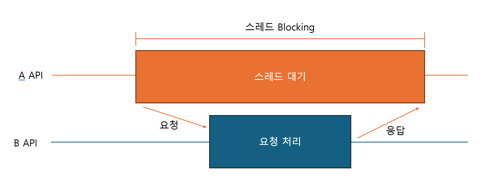
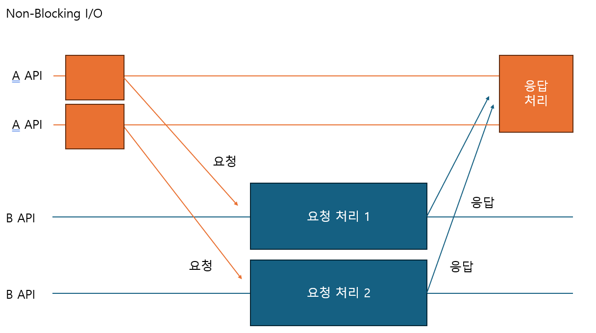

# Blocking I/O 방식과 Non-Blocking I/O 방식

## Blocking I/O 방식

- 작업 스레드가 종료될 때까지 요청 스레드는 차단된다.
- 1 Request 1 Thread 방식
- 이러한 단점을 보완하기 위해 멀티 스레딩 기법을 사용할 수 있음 \
    => CPU 대비 많은 수의 스레드를 사용하는 애플리케이션은 비효율적이다.
    - [Context Switching](/Java/multi-thread/Process_Thread_Context%20Switch/page.md)으로 인한 스레드 전환 비용 발생
    - 메모리 사용에 있어 오버헤드 발생
    - 스레드 풀에서의 응답 지연 문제

## Non-Blocking I/O 방식

- 작업 스레드의 종료와 상관 없이 요청한 스레드는 차단되지 않는다.
- 스레드 전환 비용이 적게 발생한다.
- CPU 대기 시간 및 사용량에 효율적
- <b>CPU를 많이 사용하는 작업이 포함되어 있을 경우 성능에 악영향 !</b>
- <b>Blocking I/O 요소가 포함될 경우 Non-Blocking의 이점을 발휘하기 힘들다 !</b>