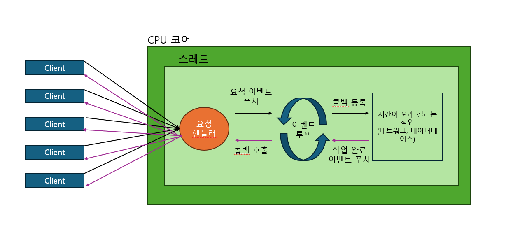

# Spring Webflux
- Spring 5부터 지원하는 리액티브 웹 프레임워크
- 비동기 Non-Blocking I/O 방식으로 적은 수의 Thread 사용
- Reactive Streams의 구현체 중 하나인 Reactor에 의존해 비동기 로직을 구성하고 Reactive Stream을 제공
- Reator 기반이지만 RxJava 등 다른 리액티브 확장 라이브러리를 쉽게 적용할 수 있다
- Spring Webflux 자체의 학습 비용보다 Reactor의 학습 비용이 더 큼

 

## Spring Webflux Process

 

## Spring Webflux를 사용하기 좋은 시스템
- 대량의 요청 트래픽이 발생하는 시스템에서 사용하면 좋은 성능을 가진다
- 대량의 요청으로 애를 먹는다면 전환해보는 것도 고려하면 좋다
- 마이크로 서비스 기반 시스템
- 스트리밍 시스템 또는 실시간 시스템
- 네트워크 접속이 느린 클라이언트의 요청 처리하면 좋다 (접속이 느린 클라이언트가 스레드를 계속 물고있지 않기 때문)

 

## 관련 소스 코드
https://github.com/cos850/webflux-java