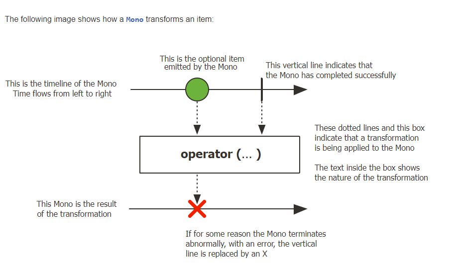
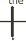
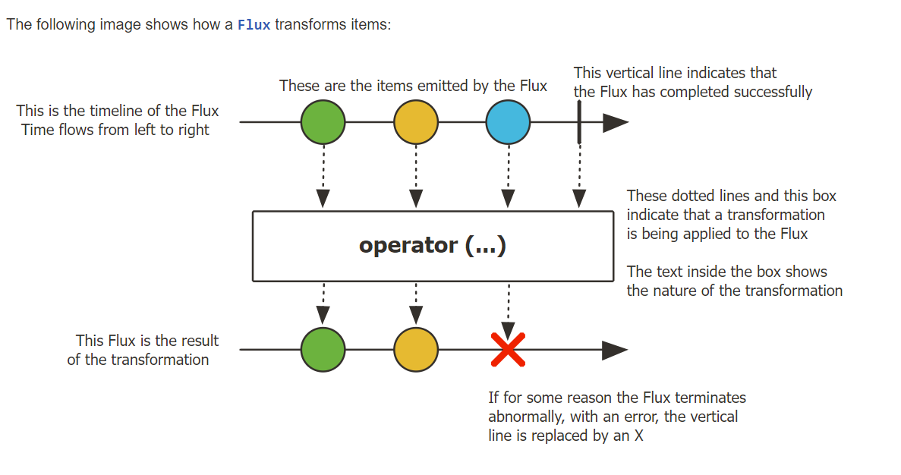

# Flux와 Mono

## Mono
- 0개 또는 1개의 데이터를 emit하는 Publisher
- 데이터 emit 과정에서 에러가 발생하면 onError signal을 emit한다. (에러를 처리하기 위한 메서드를 호출한다)

<br />

### 마블다이어그램 - Mono


#### 1. Upstream Mono timeline

|요소|설명|
|:--:|:--:|
||Mono에서 데이터를 emit 한다|
||Mono의 emit 과정이 정상 종료되면 onComplete signal을 emit한다|

#### 2. Operator
- operator를 통해 데이터를 가공한다

```java
Mono.just("hi")
.map(message -> message.toUppercase())  // operator
...
```

#### 3. Downstream Mono timeline
|요소|설명|
|:--:|:--:|
||Mono의 처리가 비정상적으로 종료될 경우 onError signal을 emit한다|


<br /><br />

## Flux
- 0 ~ N 개의 데이터를 emit하는 Publisher
- 데이터를 emit하는 과정에서 에러가 발생하면 onError signal을 emit한다

<br />

### 마블다이어그램 - Flux


#### 1. Upstream Flux timeline

|요소|설명|
|:--:|:--:|
||Flux에서 emit한 데이터|
||Flux의 emit 과정이 정상 종료되어 onComplete signal을 emit한다 |

#### 2. Operator
- operator를 통해 데이터를 가공한다.
ex) 

```java
Flux.just("hello", "reactor")
.map(message -> message.toUppercase())  // operator
...
```

#### 3. Downstream Flux timeline
|요소|설명|
|:--:|:--:|
||Flux의 처리가 비정상적으로 종료될 경우 onError signal을 emit한다|

<br /> <br />

## Sample Code

### Mono Sample code
#### 예제 1
```java
Mono.just("Hello Reactor!") 
    .subscribe(message -> System.out.println(message));
```

- `Mono.just(data)`: Mono의 just operator를 사용해 한 개의 데이터를 downStream으로 emit한다 (onNext signal 에 실어서 보낸다) 
- `.subscribe(lamdaFunction)`: emit된 데이터는 람다 표현식의 인자로 들어와 Subscriber가 처리한다.

<br />

#### 예제 2 - 데이터 없이 onComplete signal만 emit하는 경우
```
Mono.empty()
    .subscribe(
            data -> System.out.println("emitted data = " + data),
            error -> System.out.println("emitted onError signal"),
            () -> System.out.println("emitted onComplete signal")
    );

// print:
// emitted onComplete signal
```

- Mono라는 Publisher에서 데이터를 emit 하면 첫번째 람다(data)가 실행되고
- 오류가 발생하면 두번째 람다 함수(error)가 실행되고
- 상위 upstream에서 모든 데이터를 emit한 후 onCompleted signal을 emit하여 마지막 인자 부분이 실행된다