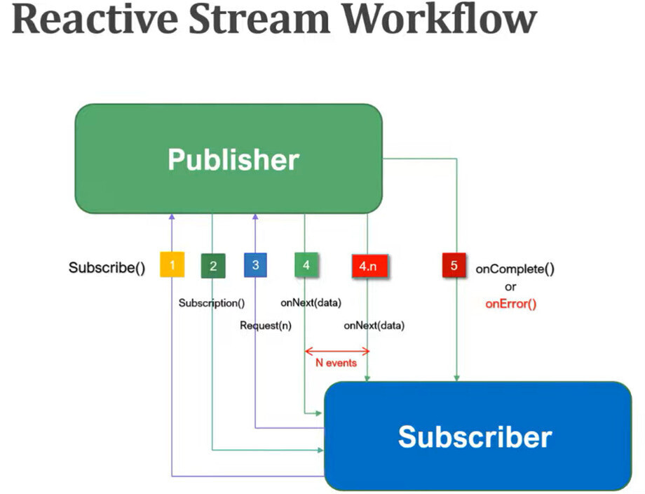
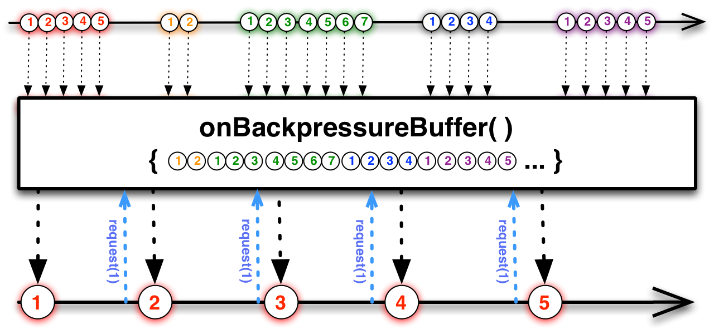
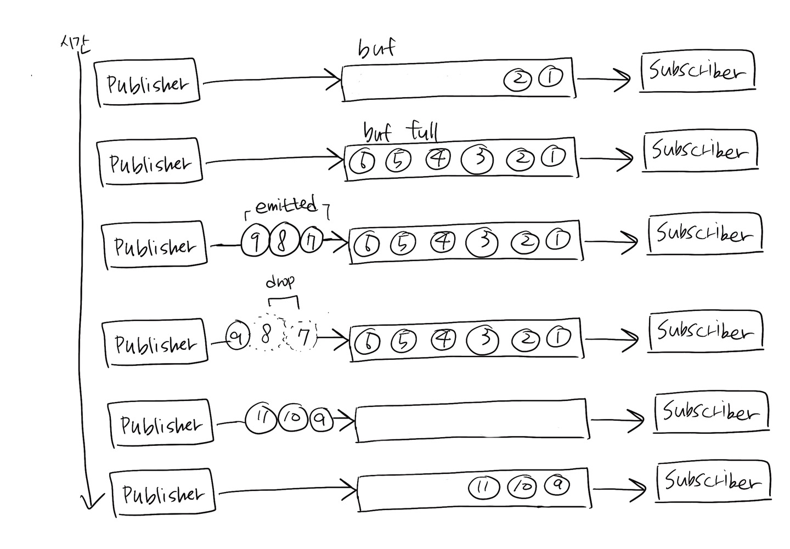

# BackPressure

## Publisher 와 Subscriber 간의 프로세스

1. subscribe() 를 통해 구독 시작
2. publisher가 onSubscribe 시그널을 통해 정상적으로 구독이 이루어졌음을 보냄
3. subscriber가 publisher에게 request 시그널을 보냄
4. publisher는 onNext라는 시그널을 전달하면서 데이터 emit \
4-1. Subscriber가 emit 된 데이터의 처리가 끝나면 다시 request 시그널을 보냄 \
4-2. onNext를 통해 데이터 emit. 4-1 ~ 4-2 과정 반복
5. 더이상 보낼 데이터가 없으면 onComplete 시그널을 Subscriber에게 전달한다

## Backpressure 란?
Publisher에서 emit되는 데이터를 Subscriber 쪽에서 안정적으로 처리하기 위한 제어기능

 

publisher에서 emit되는 속도가 빠르나, Subscriber에서 처리하는 속도는 느린 경우
데이터가 유실되거나, 데이터가 많이 쌓여 시스템에 과부화가 올 수 있다.

## Reactor에서 Backpressure 처리

### 1. 요청데이터의 개수 제어

Subscriber가 적절히 처리할 수 있는 수준의 데이터 개수를 Publisher에게 요청

    - Subscriber -데이터_2개_요청-> Publisher
    - Publisher -데이터2개emit-> Subscriber
    - Subscriber 데이터 처리
    - Subscriber -데이터_2개_요청-> Publisher
    - ... 반복

### 2. BackPressure 전략 사용

Reactor에서 제공하는 BackPressure 전략 사용

|전략|설명|
|:--:|:--:|
|IGNORE|BackPressure 적용 안함|
|ERROR|Downstream으로 전달할 데이터가 버퍼에 가득 찰 경우 Exception 발생시킴|
|DROP|Downstream으로 전달할 데이터가 버퍼에 가득 찰 경우 버퍼 밖에서 대기하는 emit된 데이터부터 Drop 함 (subscriber에게 전달되지 않음)|
|LATEST|Downstream으로 전달할 데이터가 버퍼에 가득 찰 경우 버퍼 밖에서 대기하는 가장 최근에 emit된 데이터부터 버퍼에 채우는 전략|
|BUFFER|Downstream으로 전달할 데이터가 버퍼에 가득 찰 경우 버퍼 안에 있는 데이터를 Drop 시키는 전략|

#### Drop
  

 #### LATEST
 Drop과 유사하게 동작하지만, Drop은 버퍼가 비워질 때까지 데이터를 모두 폐기하는 반면, Latest 는 최신 데이터 1개는 유지한다.

예를 들어, 버퍼가 가득 찬 상태에서 A, B, C 데이터가 차례대로 전달 되고 있고, 버퍼가 비워지지 않고 있다면
- Drop 전략은 A, B, C 데이터 모두 폐기한다
- Lastest 전략은 A 데이터 유지했다가, B 데이터가 들어오면 A 를 폐기하고, C 데이터가 들어오면 B 데이터를 폐기하는 방식으로 동작한다. 따라서 버퍼가 비워지면 C 데이터는 버퍼에 추가될 수 있는 것!

