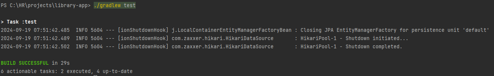
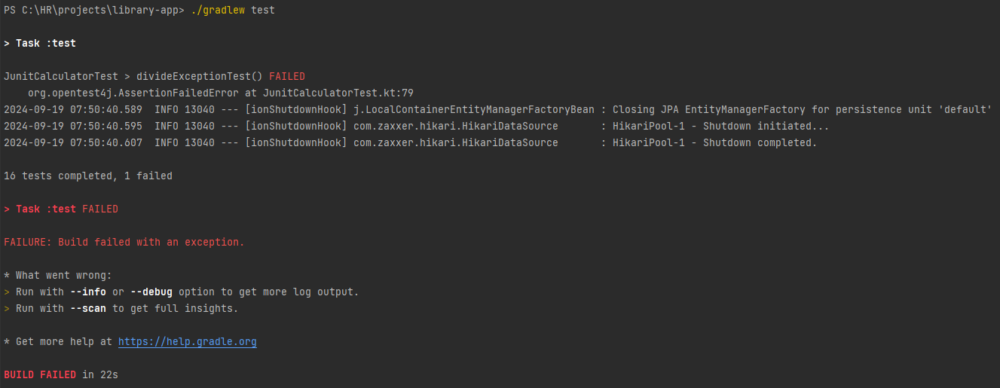
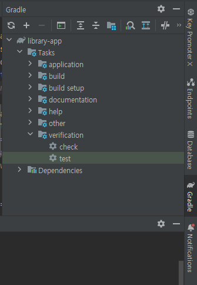
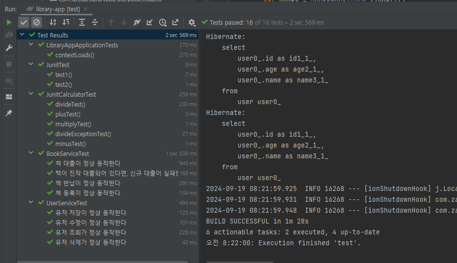

# 프로젝트 전체 테스트

Gradle을 통해 프로젝트에 작성한 테스트를 모두 실행해보는 방법이다.

<br />

## 터미널

IDE에 관계 없이 터미널을 통해 테스트하는 방법이다.

터미널의 프로젝트 폴더에서 아래 명령어를 실행한다.


```
PS C:\HR\projects\library-app> ./gradlew test
```

- 성공 시


<br />

- 실패 시


테스트가 실패할 경우 실패한 테스트의 클래스와 메서드, 실패한 라인 번호를 함께 알려줘서 찾는데 도움을 준다.

<br />

## IntelliJ

IntelliJ에 Gradle 탭에서 실행시킬 수 있는 방법이다.

오른쪽의 [Gradle] 탭 > Tasks > verification > test 클릭



<br />

- 결과
