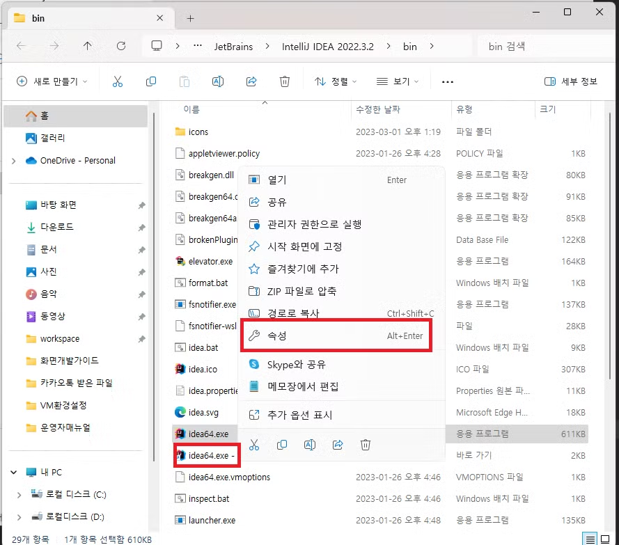
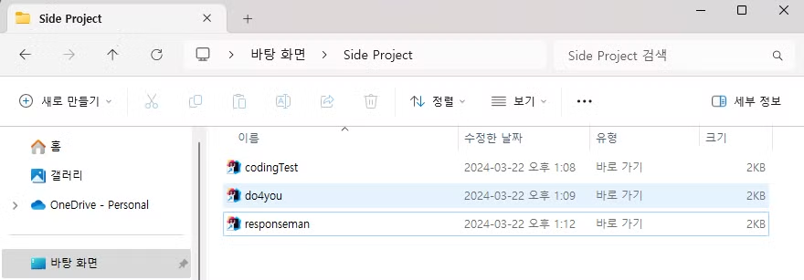
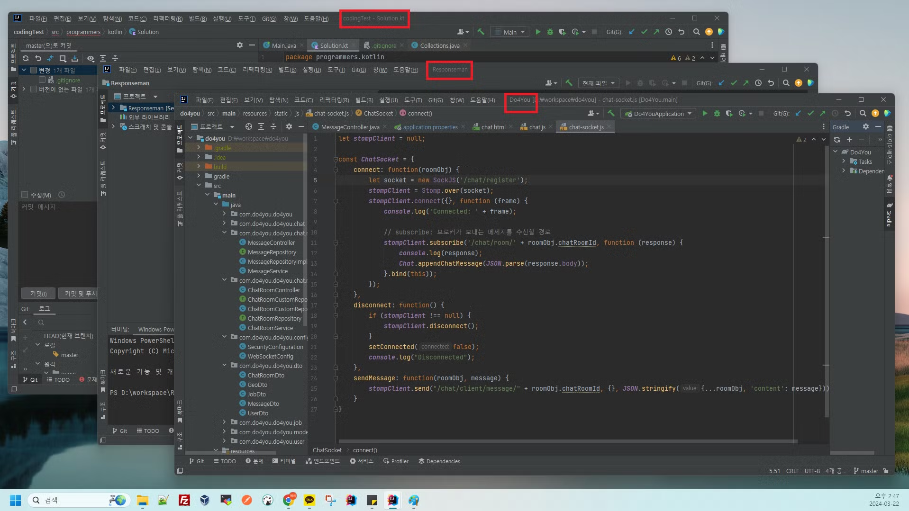
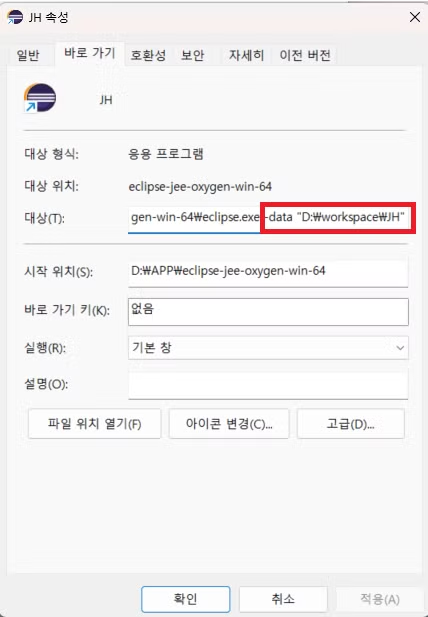

# [IntelliJ] 프로젝트별 IntelliJ 실행하기 - Windows

> 💡 IntelliJ 앱에서 작업할 프로젝트별로 바로가기를 생성하는 방법

 

해당 방법은 인텔리제이 실행할 작업 폴더를 미리 지정해서 저장해두고 바로 실행하는 방법으로, **관련성이 없는 여러 프로젝트 유지보수/관리 시 사용**하는 것을 추천한다.

만약 한 어플리케이션이 MSA 방식으로 구성되어 있는 경우에는 IntelliJ의 모듈 기능을 사용해서 하나의 IntelliJ 창에서 여러 프로젝트를 추가하는 방법을 추천한다.

관련 방법은 다른 블로그를 참조: \
[[IntelliJ] 자바 멀티 프로젝트(모듈) 생성하기](https://whitepaek.tistory.com/47)

 

## 1. 프로젝트 별로 IntelliJ 바로 가기 만들기

#### 1. 바로 가기 속성 열기 (Alt + Enter)

 

#### 2. 바로 가기 탭의 “대상” 속성에 idea64.exe 위치가 값으로 지정되어 있는데,   해당 값 맨 뒤 한 칸 띄우고 사용할 프로젝트의 절대 경로를 입력한다.   (경로에 띄어쓰기가 있다면 쌍 따옴표로 감싸기)

 

#### 3. 변경한 속성 저장 후 바로 가기 이름을 프로젝트명으로 지정해 사용하면 프로젝트별 관리가 용이하다

 

#### 4. 이제 바로 가기를 클릭하면 원하는 프로젝트를 바로 인텔리제이로 실행할 수 있다

 
 

## 2. 프로젝트별로 Eclipse 바로 가기 만들기

번외로, Eclipse에서도 비슷한 방법을 사용해 workspce를 지정해서 바로 가기를 만들 수 있다.

이클립스 바로가기를 만들고 속성 창을 켠 후, 대상(T) 의 **기존 값 맨 뒤에 한 칸 띄우고 `-data “workspace 절대경로”`** 로 설정해주면 된다.

- **속성 설정 정보**

